## Linux Epoll I/O 多路复用机制详解
前置知识要求：
- [红黑树算法实现](#clip1)
- [红黑树基本原理](#clip2)

<span id="clip1"></span>

### 红黑树算法实现

首先，引用一下 Linux 官方实现文档中关于 [What is red-black trees](https://github.com/torvalds/linux/blob/master/Documentation/core-api/rbtree.rst) 的描述：
- Red-black trees are a type of self-balancing binary binary search tree. (红黑树是一种自平衡的二叉搜索树)
- Used for storing sortable key/value data pairs. (用于存储可排序的键值对)

- Red-black trees are similar to AVL trees, (红黑树与 AVL 树类似，AVL 即平衡二叉树) 
- but provide faster real-time bounded worst case performance for insertion and deletion <u>(at most two rotations and three rotations, respectively</u>, to balance the tree), with slightly slower <u>(but still O(logn))</u> lookup time.

#### 不用看太多的前置 include 和宏定义，我们看一下 rb_tree.h 文件的一些基本的结构体定义和函数重命名

<span id="clip3"></span>
``` C
struct rb_node
{
    unsigned long __rb_parent_color;  // 当前红黑结点的父结点的颜色
    struct rb_node* rb_right;         // 当前红黑结点的右子结点
    struct rb_node* rb_left;          // 当前红黑结点的左子结点
} __attribute__((aligned(sizeof(long))));
// 这里的 align 编译器指令宏用于指定结构体的对齐方式，这里指定为 long 的大小，即 8 字节

// 额外封装了一个代表根结点的结构体
struct rb_root
{
    struct rb_node* rb_node;
};

// 这里的 & ~3 和颜色的具体数值定义有关
// 因为 RED 和 BLACK 信息保存在 __rb_parent_color 的最低一位
// 这里使用 ~3 掩码来清除低 3 位的信息，返回的就是 r 的父结点指针
#define rb_parent(r) ((struct rb_node*)((r)->__rb_parent_color & ~3))

// 第二个大括号是一个初始化列表，用于把 rb_root 的 rb_node 成员初始化为 NULL
// 这个逗号不用管，编译器是允许的，而且它并没有实际的作用
#define RB_ROOT {struct rb_root} { NULL, }

// container 宏用于获取这个 ptr 指针代表的结构体成员所在的结构体的地址
// type 和 member 用于计算 ptr 指针在结构体类型中的偏移量，也就是 offsetof(type, member)，这里的 type 是结构体的类型，member 是结构体成员的名称
// (char*)(ptr)-offsetof(type, member) 就是 ptr 指针代表的结构体成员所在的结构体的地址
#define rb_entry(ptr, type, member) container_of(ptr, type, member)

// 用于判断一个红黑树结点是否为空结点
// 这里似乎就是 hard-code 的判空逻辑，如果 __rb_parent_color 的值等于了当前结点的地址，那么这个结点就是空结点
#define RB_EMPTY_NODE(node) \
        ((node)->__rb_parent_color == (unsigned long)(node))
// 用于清空一个红黑树结点
#define RB_CLEAR_NODE(node) \
        ((node)->__rb_parent_color = (unsigned long)(node))

// 注意，这个函数是用于调整红黑树的平衡性的，并不是进行结点添加的
extern void rb_insert_color(struct rb_node*, struct rb_root*);
extern void rb_erase(struct rb_node*, struct rb_root*);

// 逻辑上的前序和后序结点
/* Find logical next and and previous nodes in a tree */
extern struct rb_node* rb_next(const struct rb_node*);
extern struct rb_node* rb_prev(const struct rb_node*);
extern struct rb_node* rb_first(const struct rb_root*);
extern struct rb_node* rb_last(const struct rb_root*);

// 后序遍历函数，先访问子结点，再访问父结点
/* Postorder iteration - always visit the parent after its children */
extern struct rb_node* rb_first_postorder(const struct rb_root*);
extern struct rb_node* rb_next_postorder(const struct rb_node*);

// 替换红黑树中的结点，不做任何的删除和重新平衡的操作
/* Fast replacement of a single node without remove/rebalance/add/rebalance */
extern void rb_replace_node(struct rb_node* victim, struct rb_node* new, struct rb_node* root);

// 这里的写法可能有些奇怪，但是 rb_link 从后文用法来看，它就是 parent 的某个子结点的指针的指针，这里用这样的方式来对其进行赋值
// 总结来说，这个函数用于把 node 插入到 parent 的某个子结点的位置上
// 补充一点，这个函数内部第一行
// (usnigned long)parent 的用法：
// rb_node 的第一个成员就是 unsigned long 类型的信息位
// 所以这种强制类型转换，就是告诉编译器，我们只需要使用开头的这个信息位
// 而不需要后面的两个指针信息
static inline void rb_link_node(struct rb_node* node, struct rb_node* parent, struct rb_node** rb_link)
{
    node->__rb_parent_color = (unsigned long)parent;
    node->rb_left = node->rb_right = NULL;

    *rb_link = node;
}

// 封装了一下 rb_entry 宏，用于安全地获取一个成员指针所在的结构体的地址
#define rb_entry_safe(ptr, type, member) \
        ({ typeof(ptr) ____ptr = (ptr); \
           ____ptr ? rb_entry(____ptr, type, member) : NULL; \
        })
```

-- -
#### 接下来是一些基本红黑树操作的内联实现
``` C
/**
 * rbtree_postorder_for_each_entry_safe - iterate in post-order over rb_root of
 * given type allowing the backing memory of @pos to be invalidated
 * 
 * @pos:   the 'type *' to use as a loop cursor.
 * @n:     another 'type *' to use as temporary storage
 * @root:  'rb_root *' of the rbtree.
 * @field: the name of the rb_node field within 'type'.
 * 
 * rb_tree_postorder_for_each_entry_safe() provides a similar guarantee as 
 * list_for_each_entry_safe() and allows the iteration to continue independent 
 * of changes to @pos by the body of the loop.
 * 
 * Note, however, that is cannot handle other modifications that re-order the 
 * rbtree it is iterating over. This includes calling rb_erase() on @pos, as rb_erase() may rebalance the tree, causing us to miss some nodes.
 * */
#define rb_tree_postorder_for_each_entry_safe(pos, n, root, field) \
   for(pos = rb_entry_safe(rb_first_postorder(root), typeof(*pos), field); \
       pos && ({n = rb_entry_safe(rb_next_postorder(&pos->field), \
       typeof(*pos), field); 1; }); \
       pos = n)
/* 
    展开看一下：
    for(pos = rb_entry_safe(rb_first_postorder(root), typeof(*pos), field); )
    这里是 for 循环三段内容中的第一段，用于初始化 pos 变量，让它指向 root 红黑树的第一个结点
    pos && ({n = rb_entry_safe(rb_next_postorder(&pos->field), typeof(*pos), field); 1; }); )
    这里是 for 循环三段内容中的第二段，用于获取 pos 指针指向的结构中的下一个结点指针
    同时，它也是一个语句表达式扩展， {n = rb_entry_safe(rb_next_postorder(&pos->field), typeof(*pos), field); 1; } 这个语句块的返回值就是后面的这最后一个表达式，也就是 1;
    pos = n;
    这里是 for 循环三段内容中的第三段，用于更新 pos 变量，让它指向后序遍历中的下一个结点
*/

// 根据名字推断，这个函数用于把 n 从 root 红黑树中删除，并且把 n 本身清空
static inline void rb_erase_init(struct rb_node* n, struct rb_root* root)
{
    rb_erase(n, root);
    RB_CLEAR_NODE(n);
}
```

``` C
/**
 * leftmost-cached rbtrees
 * 这个最左缓存红黑树，目前还不清楚是什么意思，往下看（）
 * 
 * We do not cache the rightmost node based on footprint
 * size vs number of potential users that could benefit
 * from O(1) to rb_last(). Just not worth it, users that want
 * this feature can always implement the logic explicitly.
 * Furthermore, users that want to cache both pointers may 
 * find it a bit asymmetric, but that's ok.
 * */
// 缓存结构体，保存的是一棵红黑树，以及该红黑树的最左侧结点
struct rb_root_cached
{
    struct rb_root rb_root;
    struct rb_node* rb_leftmost;
};

// 初始化一个空的缓存结构体
#define RB_ROOT_CACHED {struct rb_root_cached} { {NULL, }, NULL }

/* Same as rb_first(), but O(1) */
#define rb_first_cached(root) root->rb_leftmost

// 封装了 rb_insert_color 函数
static inline void rb_insert_color_cached(struct rb_node* node, struct rb_root_cached* root, bool leftmost)
{
    // 如果规定这个结点要插入成最左结点，那么就把 root 的 rb_leftmost 成员设置成 node
    if(leftmost)
        root->rb_leftmost = node;
    // 将 root 中的 node 结点进行平衡调整，维护树的红黑性质
    rb_insert_color(node, &root->rb_root);
}

// 封装了 rb_erase 函数
static inline void rb_erase_cached(struct rb_node* node, struct rb_root_cached* root)
{
    // 如果 node 是 root 红黑树的最左侧结点，那么就把 root 的 rb_leftmost 成员设置成 node 的下一个结点
    if(root->rb_leftmost == node)
        root->rb_leftmost = rb_next(node);
    // 将 node 从 root 红黑树中删除
    rb_erase(node, &root->rb_root);
}

// 封装了 rb_replace_node 函数
static inline void rb_replace_node_cached(struct rb_node* victim, struct rb_node* new, struct rb_root_cached* root)
{
    // 如果 victim 是 root 红黑树的最左侧结点，那么就把 root 的 rb_leftmost 成员设置成 new
    if(root->rb_leftmost == victim)
        root->rb_leftmost = new;
    // 用 new 结点替换 victim 结点
    rb_replace_node(victim, new, &root->rb_root);
}
```

``` C
/**
 * The below helper functions use 2 operators with 3 different
 * calling conventions. The operators are related like:
 * 
 * comp(a->key, b) < 0  := less(a, b)
 * comp(a->key, b) > 0  := less(b, a)
 * comp(a->key, b) == 0 := !less(a,b) && !less(b,a)
 * 
 * 下面提到的 partial order，也就是偏序，代表，集合中并不是所有元素都是可以进行比较的
 * If these operators define a partial order on the elements we make no
 * guarantee on which of the elements matching the key is found. See
 * rb_find().
 * 
 * The reason for this is to allow the find() interface without requiring an 
 * on-stack dummy object, which might not be feasible due to object size.
 * */
```

``` C
/**
 * rb_add_cached() - insert @node into the leftmost cached tree @tree
 * @node: node to insert
 * @tree: leftmost cached tree to insert @node into
 * @less: operator defining the (partial) node order
 * */
static __always_inline void rb_add_cached(struct rb_node* node, struct rb_root_cached* tree, bool (*less)(struct rb_node*, const struct rb_node*))
{
    // link 二级指针指向 tree 的根结点
    struct rb_node** link = &tree->rb_root.rb_node;
    struct rb_node* parent = NULL;
    bool leftmost = true;

    // link 用于遍历红黑树，找到合适的位置插入 node 结点
    while(*link)
    {
        parent = *link;
        // 如果 node 的 key 小于 parent 的 key，那么可能的插入位置就在 parent 的左子树中
        // 否则，可能的插入位置就在 parent 的右子树中
        if(less(node, parent))
        {
            link = &parent->rb_left;
        } 
        else
        {
            link = &parent->rb_right;
            leftmost = false;
        }
    }

    // 结点插入，不做平衡调整
    rb_link_node(node, parent, link);
    // 进行平衡调整，包含缓存操作
    rb_insert_color_cached(node, tree, leftmost);
}

/**
 * rb_add() - insert @node into @tree
 * @node: node to insert
 * @tree: tree to insert @node into
 * @less: operator defining the (partial) node order
 * */
static __always_inline void rb_add(struct* node, struct rb_root* tree, bool (*less)(struct rb_node*, const struct rb_node*))
{
    struct rb_node** link = &tree->rb_node;
    struct rb_node* parent = NULL;

    while(*link)
    {
        parent = *link;
        if(less(node, parent))
            link = &parent->rb_left;
        else
            link = &parent->rb_right;
    }

    rb_link_node(node, parent, link);
    rb_insert_color(node, tree);
}
```

``` C
/**
 * rb_find_add() - find equivalent @node in @tree, or add @node
 * @node: node to look-for / insert
 * @tree: tree to search / modify
 * @cmp: operator defining the node order
 * 
 * Returns the rb_node matching @node, or NULL when no match is found and @node
 * is inserted.
 * */

// 复合功能函数，用于从 tree 中检查是否有和 node 等价的结点
// 如果有等价的结点，那么就直接返回这个等价结点的指针，否则，进行新结点添加，并返回 NULL
static __always_inline struct rb_node* rb_find_add(struct rb_node* node, struct rb_root* tree, int (*cmp)(struct rb_node*, const struct rb_node*))
{
    struct rb_node **link = &tree->rb_node;
    struct rb_node* parent = NULL;
    int c;

    while(*link)
    {
        parent = *link;
        c = cmp(node, parent);
        
        if(c < 0)
            link = &parent->rb_left;
        else if(c > 0)
            link = &parent->rb_right;
        else
            return parent;
    }

    rb_link_node(node, parent, link);
    rb_insert_color(node, tree);
    return NULL;
}

/**
 * rb_find_first() - find the first @key in @tree
 * @key: key to match
 * @tree: tree to search
 * @cmp: operator defining node order
 * 
 * Returns the leftmost node matching @key, or NULL.
 * */
static __always_inline struct rb_node* rb_find_first(const void* key, const struct rb_root* tree, int (*cmp)(const void* key, const struct rb_node*))
{
    struct rb_node* node = tree->rb_node;
    struct rb_node* match = NULL;

    while(node)
    {
        int c = cmp(key, node);

        if(c <= 0)
        {
            // 如果找到了，那么就更新 match 返回值，并继续往左探查，这一点跟注释说明的，找出最左侧的等价结点是统一的
            if(!c)
                match = node;
            node = node->rb_left;
        } else if(c > 0)
        {
            node = node->rb_right;
        }
    }

    return match;
}

/** 
 * rb_next_match() - find the next @key in @tree
 * @key: key to match
 * @tree: tree to search
 * @cmp: operator defining node order
 * 
 * Returns the next node matching @key, or NULL.
 * */
static __always_inline struct rb_node* rb_next_match(const void* key, struct rb_node* node, int (*cmp)(const void* key, const struct rb_node*))
{
    // 先调用 rb_next 函数，找出 node 的中序下一个结点
    node = rb_next(node);
    // 如果这个下一个结点的值并不等于 node 的值，那么清空返回值
    // cmp 返回值非 0，代表两个值不相等
    if(node && cmp(key, node))
        node = NULL;
    // 返回结果
    return node;
}

// 这个函数的意义是什么呢？
/**
 * rb_for_each() - iterates a subtree matching @key
 * @node: iterator
 * @key: key to match
 * @tree: tree to search
 * @cmp: operator defining node order
 * */
#define rb_for_each(node, key, tree, cmp) \
        for ((node) = rb_find_first((key), (tree), (cmp)); \
             (node); (node) = rb_next_match((key), (node), (cmp)))
/*
    简单阅读一下这部分：
    for ((node) = rb_find_first((key), (tree), (cmp)); )
        for 循环的初始化 (第一段)，把 node 初始化成 tree 树中的第一个结点
    (node);
        for 循环的判断条件 (第二段)，这里只要 node 非空，就继续遍历
    (node) = rb_next_match((key), (node), (cmp))
        for 循环的更新步 (第三段)，用于从 node 代表的子树中找出下一个键值等于 key 的结点
*/
```

-- -
### 好，到这里先停一下，看完了头文件，我们来总结一下：
- 个人认为，Linux 官方源码对红黑树的实现并没有跳脱出《算法导论》第 13 章讲解的原理
- 有一个细节：
    - 官方代码在处理红黑树的插入和删除时，把删除步骤单独封装成了一个 rb_erase() 函数，并声明成了 extern，而插入步骤则分了详细的 rb_insert_color() 平衡步和 rb_link_node() 添加步
    - 个人猜测是编写者认为删除代码实在是不好理解，于是直接写了一个大函数（）
    - 不过估计但凡是完整阅读过算法导论第13章的同学，就知道删除操作的确很复杂（）
- <u>Linux 引入的一个比较新颖的优化点在于</u>：
    - leftmost-cached 机制
    - 简单来说就是，缓存一棵红黑树中最靠左的那个结点，在一些查询或更新操作中（实验经验）可能会有效率提升效果
- 之后是一个疑惑点
    - 个人比较疑惑的是，最后提到的这个函数：rb_for_each()
        - 并不清楚这个函数的作用是什么
        - 按理来说，如果是一个正常的合法红黑树（注意，同时也一定是一棵二叉搜索树）
        - 那么所有值相等的结点应该都是连在一起的
        - 那么这种 ”取出整个相等值子树” 的概念是否有必要单独写一个 helper function 出来？
        - 如果有必要，那么个人认为只能是基于不合法红黑树的平衡过程中使用了

#### 其它部分都比较常规，没看懂的，多看几次就能捋顺了
-- -
### 现在，在看 rb_tree.c 实现代码之前
### 我们回顾一下 （理论上） 红黑树的实现原理

<span id="clip2"></span>
-- -

##### 声明：下面的讲解，原文来自《算法导论》第三版第十三章，这里只是根据个人理解进行了一次再讲解

#### 第一，红黑树的理论基础是下面五条性质：

1. 红黑树中的结点要么是红色的，要么是黑色的
2. 红黑树的根结点是黑色的
3. 叶子结点都是黑色的
4. 红黑树中，红色结点的孩子结点一定是黑色的
5. 对于每个结点，从该结点到所有后代<u>叶结点</u>的简单路径上，都包含相同数量的黑色结点

#### 先不用管上面这五条性质是怎么来的，往下看，你就理解了，最重要的性质是性质 5 和性质 4

##### 提问：红黑树为什么是一种效率很高的树？
- ##### 结论：一棵有 n 个<u>内部结点</u>的红黑树的高度至多为 2lg(n+1)
证明过程并不难，我们定义这样一个名词：<u>黑高 (black height)</u>
- 从某个节点 x 出发<u>（不含该结点）</u>到达一个叶结点的任意一条简单路径上的<u>黑色结点</u>的个数。记为 bh(x)。
    - 这一性质基本上可以被认为是上面性质 5 的 "因"，根据这一定义，结合上面的性质 5，可以认为每一个结点的黑高都是<u>固定的</u>
``` txt
首先，以任一结点 x 为根的子树中至少包含 2^bh(x)-1 个内部结点
用归纳法可以证明：
    归纳基础步：如果 x 的 高度 为 0，那么 x 一定是叶子结点 (T.nil)

        且以 x 为根结点的子树至少包含 2^bh(x)-1 = 2^0-1 = 0 个内部结点，结论成立

    归纳步：考虑一个高度为正值且有两个子结点的内部结点 x。每个子结点有黑高 bh(x) 或 bh(x)-1 （取决于子结点本身是红结点还是黑结点）

    因为子结点的高度是低于 x 的，那么根据归纳假设，我们知道 每个 子结点至少有 2^(bh(x)-1)-1 个内部结点。（至多有 2^(bh(x)-1) 个内部结点

    那么我们就知道，以 x 为根的子树应该至少包含 

    (2^(bh(x)-1)-1)*2(两个子树) + 1(x 结点自身，它一定不是叶结点) = 2^bh(x)-1 

    个内部结点
    归纳法得证

其次，考虑之前的结论，h <= 2lg(n+1) (n 为内部结点个数)

    这里用到性质 4，从根结点到任意一个叶结点的简单路径上都至少有一半的结点为黑色。

    故，根的黑高至少为 h/2

    所以对于根结点有：

    n >= 2^(h/2)-1 (其中 n 为根结点代表的树，也就是整棵树的内部结点个数)

    转换一下，得到：

    lg(n+1) >= h/2 (其中 lg 以 2 为底)

    即

    h <= 2lg(n+1)
```

- 至此，我们已经了解了红黑树为什么效率较高，也明白了看起来不那么直接的性质 4 和性质 5 到底是怎么来的

### 接下来，回顾一下我们上面看过的 .h 头文件
#### 如果你比较细心，应该已经发现了，.h 头文件中编写者很工整地排列了所有需要在 .c 文件中实现的外部函数 (extern 修饰的所有函数)

- 我们先不急着看它们的具体实现，思考永远比读代码来得简单

- 首先来看一个 "如果学过二叉搜索树，一定应该会" 的知识点
    - 旋转操作
        - 我们结合一张图来研究一下
        - 其实感觉看图上的注解就足够了，不用再解释太多了（）
    
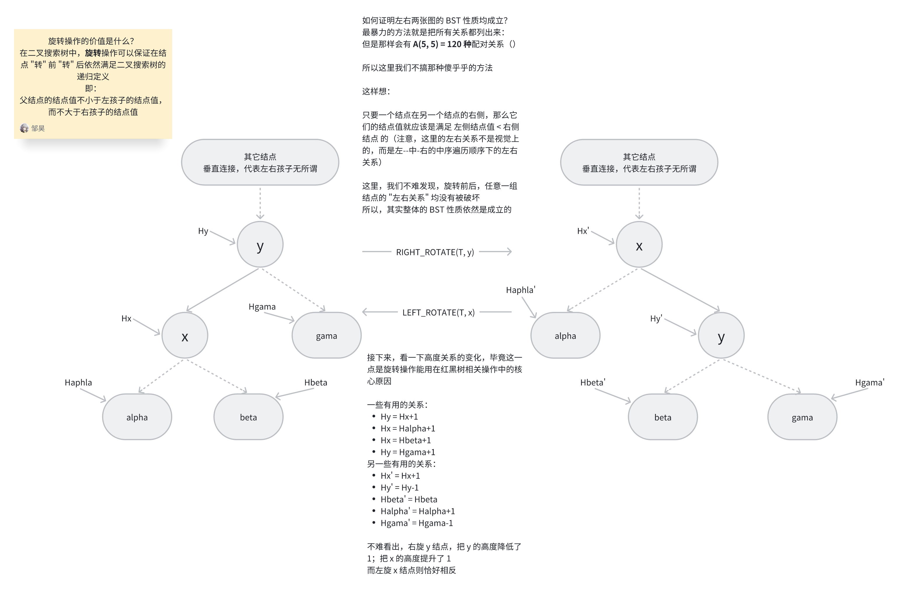

- 了解了旋转操作之后，我们就可以开始研究二叉搜索树一定绕不开的 <u> "插入" 和 "删除"</u> 操作了
#### 首先是 "插入" 操作
- 先简单一点思考，如果是一棵普通的二叉搜索树，我们怎么进行插入操作？
    - 首先肯定是定位到要插入的位置（例如哪个结点应该是新结点的父结点）
    - 之后进行常规的二叉搜索树插入即可
    - 有几个点需要思考：
        1. 插入点要着为什么颜色？
            - 这里要着为红色
            - 至于原因，个人看了一些解释，大多都是认为如果新建一个黑色结点会破坏性质 5，也就是黑高性质；
            - 这种破坏维护起来会比新建一个红色结点（<u>可能</u>破坏性质 4）维护起来困难很多
            - 同时，我们会注意到，<u>整个红黑树相关的维护算法都在竭力避免处理性质 5 被破坏的情况 (包括后面的 "删除" 相关代码)</u>
        2. 什么性质可能会被破坏，又应该怎样进行维护？
            - 根据第 1 点，我们知道把插入点着为红色，这样性质 4 就可能被破坏了，也就是说，可能不是所有的红结点的左右孩子都是一个黑结点了
            - 至于怎样进行维护，这就是 "Insert Fix up" 的核心算法了，我们下面单开一节来讲

### "插入" 操作如何维护红黑树性质？
#### 我们先给出 RB_INSERT 的 pseudocode：
``` txt
RB_INSERT(T, z)
    y = T.nil
    x = T.root
    while x != T.nil
        y = x
        if z.key < x.key
            x = x.left
        else
            x = x.right
    z.p = y
    if y == T.nil
        T.root = z
    elseif z.key < y.key
        y.left = z
    else 
        y.right = z
    z.left = T.nil
    z.right = T.nil
    z.color = RED
    RB-INSERT-FIXUP(T, z)
```
- 这一部分，抛开 RB-INSERT-FIXUP 这一部分，其它的逻辑和正常的 BST 插入操作都是完全一样的，所以这里就不多展开讲了，大家看一下应该就懂了
#### 主要来看一下 RB-INSERT-FIXUP 的 pseudocode：
``` txt
RB-INSERT-FIXUP(T, z)
    while z.p.color == RED
        if z.p == z.p.p.left
            y = z.p.p.right
            if y.color == RED
                z.p.color = BLACK
                y.color = BLACK
                z.p.p.color = RED
                z = z.p.p
            else if z == z.p.right
                z = z.p
                LEFT-ROTATE(T, z)
            z.p.color = BLACK
            z.p.p.color = RED
            RIGHT-ROTATE(T, z.p.p)
        else
            y = z.p.p.left
            if y.color == RED
                z.p.color = BLACK
                y.color = BLACK
                z.p.p.color = RED
                z = z.p.p
            else if z == z.p.left
                z = z.p
                RIGHT-ROTATE(T, z)
            z.p.color = BLACK
            z.p.p.color = RED
            LEFT-ROTATE(T, z.p.p)
    T.root.color = BLACK
```
- 用文字描述有些枯燥，我们不难看出这个函数就是一个大 while 循环
- 这里给出这个大 while 循环的三个循环不变式：
    1. 伪代码中的 z 结点在循环开头总是红色的
    2. 如果 z.p 结点是根结点，那么它是黑结点
    3. 如果有任何的红黑性质被破坏，则至多只有一条被破坏，要么是性质 2，要么是性质 4
- 上面的循环不变式（如果能正确维护）可以有下面的效果：
    - 在我们退出循环时，只有一条性质被破坏，要么是性质 2，要么是性质 4
    - 而 z 是红色结点，z.p 是黑色结点，所以退出时，性质 4 是完好的
    - 所以退出时被破坏的一定是性质 2，也就是根结点为红色
    - 那么我们最后一行 T.root.color = BLACK 就可以把性质 2 修复
#### 在真正开始看图说话前，我们先简单验证一下上面三个不变式（循环开始时）
- 首先，循环开始时，我们的 z 就指向刚刚添加的这个新结点，所以不变式 1 成立
- 其次，此时 z.p 指向的结点是原本红黑树中就有的结点，所以它一定满足红黑树的性质，如果它是根结点，那么它一定是黑色的，所以不变式 2 成立
- 最后，思考不变式 3
    - 首先性质 1 和 3 是肯定成立的，性质 5 基于我们添加新结点的逻辑，一个新的红色结点不可能影响黑高，所以它也是完好的
    - 对于性质 2，如果 z 就是根结点，那么性质 2 就被破坏了，而此时 z.p 是叶结点，它一定是黑色的，所以性质 4 是完好的
    - 而如果 z 不是根结点，那么性质 2 就是完好的，而只要 z.p 也是红色的，那么性质 4 就被破坏了
    - 综上，性质 2 和性质 4 至多只有其中一个被破坏，二者在循环开始时不会同时被破坏
#### 至于为什么我们的 pseudocode 能够保证上面的循环不变式，我们不写那么多文字，用图来讲一下

#### 假设开始时是下面的情况：
## 情况 1 : z 的叔结点 y 是红色的

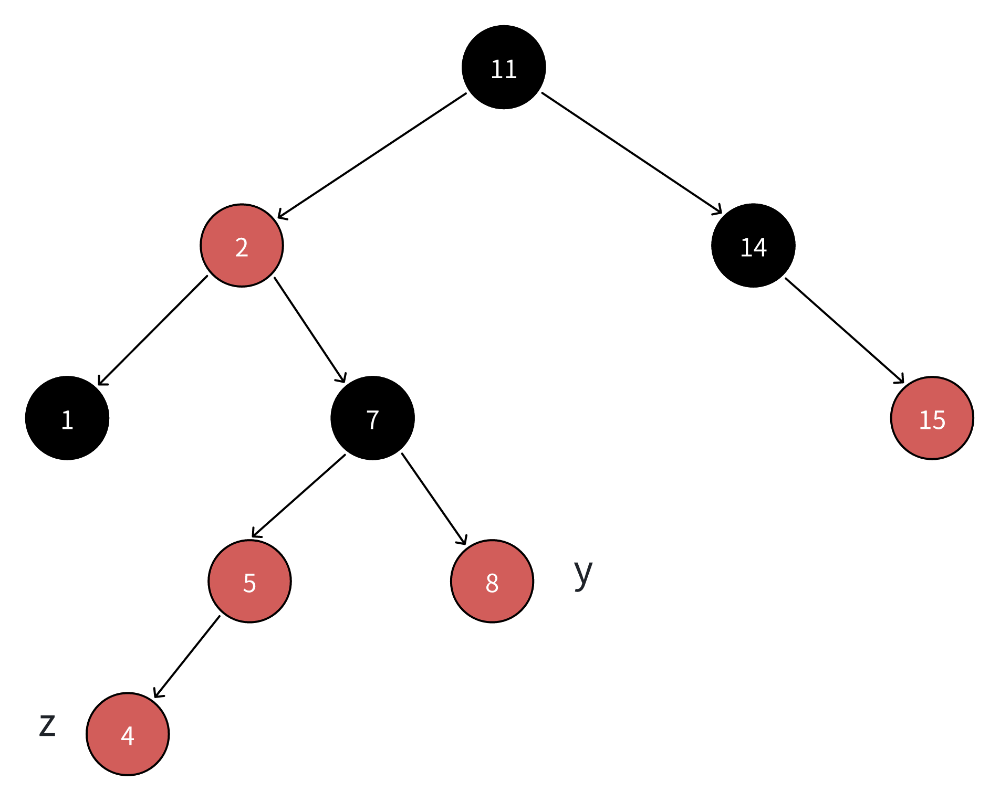

- z 很明显是我们新添加的结点
- y 是上面代码中的叔结点，放到图中，就是这种感觉
- 观察结点 z 以及它附近的结点
    - 我们发现，结点 7 这个黑结点实际上可以分裂，分裂了之后，性质 5 依然是完好的<u>（因为 7 左右都有孩子，它不是个叶结点，并且它的右孩子，也就是 z 的叔结点 y，也是红色的）</u>
    - 分裂之后结点 5 和 y 这两个原先为红色的结点就被染黑，此时结点 z 的性质 4 就恢复了
    - 分裂之后，结点 7 需要重新着为红色，因为它原本的黑色分裂下去了
    - 注意：上面这种 "分裂" 是有条件的，如果结点 y 不是红色的，那么就不能应用这种简单的分裂操作来维护结点 z 的性质
    - 分裂之后，我们会发现，原先的指针 z 实际上上移到了结点 7 的位置
    - 此时，结点 7 和结点 2 又破坏了性质 4（但是其它四条性质，包括性质 5，依然完好）
- 最后，思考我们这样的处理是否破坏了上面的循环不变式：
    - 首先，z 结点在下一轮循环开始时，依然是红色的，所以不变式 1 成立
    - 其次，我们上面的一通维护操作，修改的内容仅限于这个新的 z 结点（也就是结点 7）以及以它为根的子树内部，所以如果 z.p 为根结点，那么它也一定满足红黑树性质，所以不变式 2 成立
    - 最后，我们已经证明了，上面的操作不会影响性质 5，性质 1 和 3 也没被破坏
        - 如果性质 2 被破坏了，那么只可能是新的结点 z 是根结点，而此时 z.p 是叶结点，它一定是黑色的，所以性质 4 是完好的
        - 如果性质 4 被破坏了，那么只可能是新的结点 z 不是根结点，同时 z.p 是红色的，而 z.p 一定是红黑树中原本的结点，它不可能违反性质 2
    - 所以综上，情况 1 的这些维护操作，并不会破坏上面的循环不变式
#### 这里插播一下，上面这张图是来自教材上的，它只需要经历一次 **情况1** 就可以达到后文的 **情况2/3**
#### 所以这里个人重新画了一种递归情况，目的是为了告诉大家情况 1 是可能递归重复出现的 

## 情况1（递归）：z 的叔结点 y 是红色的
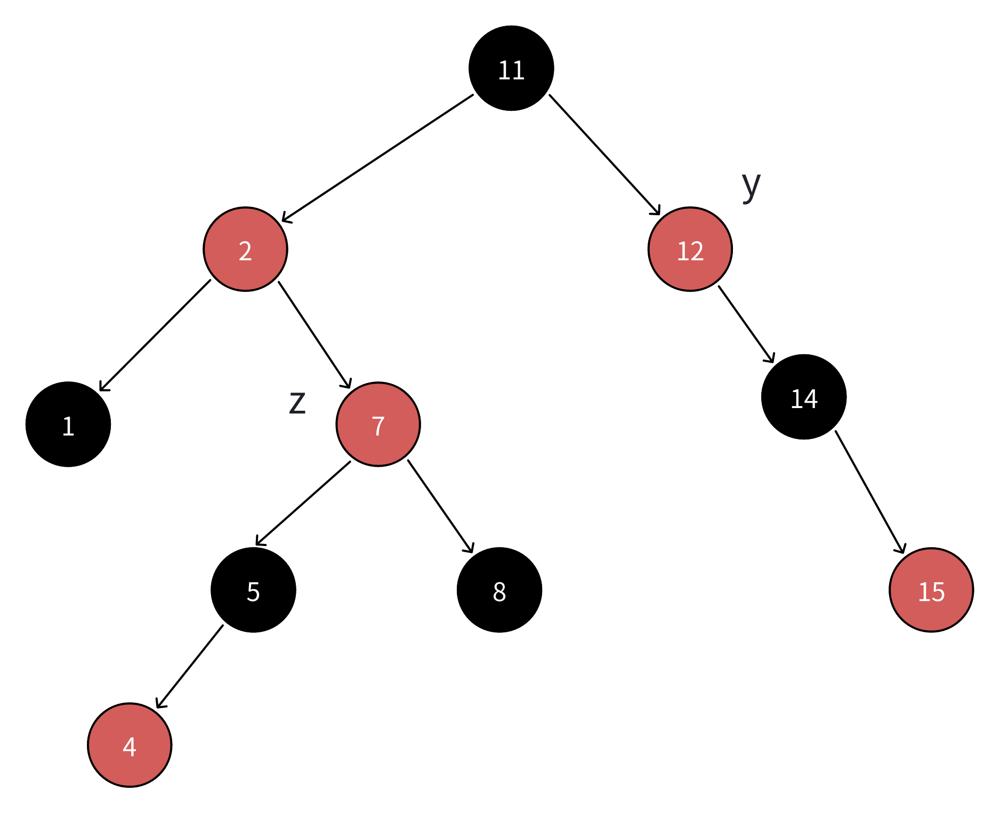
- 对比教材的情况1，我们只是把结点 11 的右孩子变成了红色，从这里也能更深刻的理解到：<u>红结点不会影响黑高，也就不会影响性质 5</u>
- 但是，我们会发现，此时新的 z 结点的叔结点 y 依然是个红结点，所以我们还是要继续递归处理

### 接下来回到教材的样图：
## 情况2: z 的叔结点 y 是黑色的，且 z 是右孩子
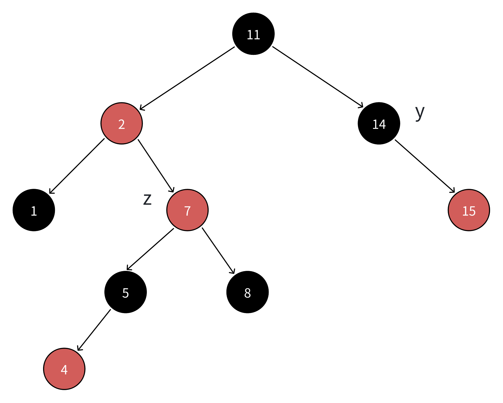
- 此时 z 的叔结点 y 变成了黑色，我们没法简单的把 z.p.p （也就是 11 这个祖父结点）的黑色分裂给 2 和 14
- 似乎没什么办法继续下去了？
    - 现在观察这张图可能没什么想法
    - 但是如果我们把 z 结点放到结点 1 的位置，让它成为 2 的左子结点，会有什么不同？

## 情况3: z 的叔结点 y 是黑色的，且 z 是左孩子
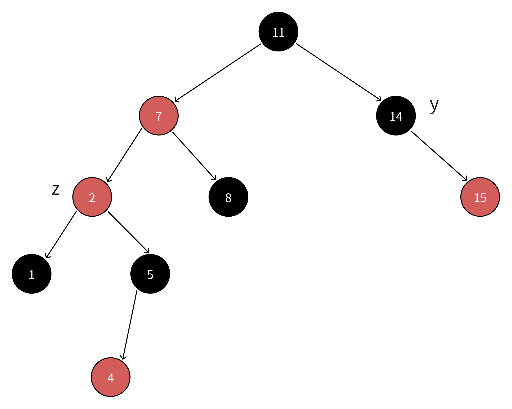
- 观察这张图，我们再试一下能否把 11 的黑色分下去
- 不难发现
    - 可以应用之前提到的 “右旋” 操作，把 11 这个结点右旋到 y 现在到位置上，并把它修改成红色
    - 同时 7 也就被旋转到了 11 原来的位置上，我们把它修改成黑色

### 拿到的图是这样的：
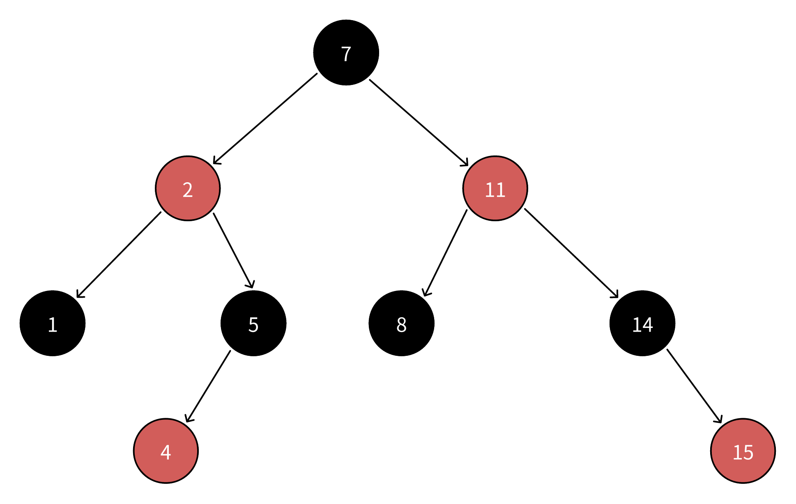
- 可以发现，我们旋转的操作只影响了结点 7 和结点 11，并同时修改了二者的颜色
- 并且，如果你仔细观察一下，会发现虽然我们修改了结点的颜色，但是通过我们的互补操作（结点 7 由红变黑，填补结点 11 变红的空缺），我们仍然保证了性质 5 的完好性
- 同时，此时我们已经不需要维护性质 4 或性质 2 了，即使结点 7 上面还有结点，由于性质 7 本身就是黑结点，性质 4 已经不可能被破坏了
- 所以情况 3 实际上就是维护的结束情况

### 对比一下情况 2 和情况 3 的两张图
## 情况2: z 的叔结点 y 是黑色的，且 z 是右孩子

## 情况3: z 的叔结点 y 是黑色的，且 z 是左孩子

- 不难发现，情况 2 只需要把结点 2 左旋一下，就可以拿到情况 3
- 并且，这次的左旋，我们没有修改任何结点的颜色，只是修改了红结点的位置，所以性质 5 依然完好
    - 结点 5 到达结点 2 这个位置的路径上依然只有红结点
    - 结点 1 到达结点 2 这个位置的路径上依然只有红结点
    - 结点 8 到达结点 2 这个位置的路径上依然只有红结点
    - 所以上面三者代表的子树，对和结点 2 这个位置的结点相连的其它上层结点来说，贡献的黑高值没有任何变化
    - 故性质 5 依然完好

### 最后，来思考一下我们的循环不变式
- 我们上面两种旋转操作都已经证明了不会影响性质 5
- 不变式 1 也是完好的，结点 z 依然指向红结点
- 不变式 2 也是完好的，结点 z.p 指向的结点是红黑树中原本的结点，它不可能违反不变式 2
- 对于循环不变式 3，其实很明显还是成立的，这里不多赘述

#### 折腾了大半天，终于理解了红黑树的插入以及对应的维护操作了
#### 这里是作者自己尝试重写的红黑树插入部分代码
``` C
/**
 * struct rbtree_node {
    void* key;
    enum color;
    struct rbtree_node* left;
    struct rbtree_node* right;
    struct rbtree_node* parent;
 };
 * */

/**
 * struct rbtree {
    struct rbtree_node* root;
 };
 * */

// 插入部分维护红黑性质代码
void rbtree_insert_fixup(struct rbtree* T, struct rbtree_node* z)
{
    /**
     * 我们重申一下 while 循环的三条循环不变式：
     * 1. z 结点是红结点
     * 2. 如果 z.p 是根结点，那么它是黑结点
     * 3. 至多只有一条性质被违反，要么是性质 2，要么是性质 4
     * */
    while(z->parent->color == RED)
    {
        // 我们分 z 是 z->parent 的左孩子和右孩子两种情况来进行讨论
        // 首先是左孩子
        if(z == z->parent->left)
        {
            // 之后细分上面提到的情况 1、2 和 3
            // 我们通过 y 结点，也就是 z 结点的叔结点的颜色，来进行讨论
            struct rbtree_node* y = z->parent->parent->right;
            // 情况 1：y 结点是红色的
            if(y->color == RED)
            {
                // 此时我们把 z->parent->parent 这个祖父结点的黑色进行分裂
                z->parent->color = BLACK;
                y->color = BLACK;
                z->parent->parent->color = RED;
                // 最后，把 z 指针指向原本的 z->parent->parent
                z = z->parent->parent;
                // 进入下一层循环判断
                continue;
            }
            // 下面两个 else 情况，y 的颜色均为黑色
            // 进一步细分：z 是左孩子还是右孩子
            else if(z == z->parent->right)
            {
                // 情况 2：y 结点是黑色的，且 z 是右孩子
                // 此时我们对 z->parent 进行左旋，把情况转换成情况 3
                z = z->parent;
                rbtree_left_rotate(T, z);
                // 注意，这个左旋不需要修改颜色，因为旋转的都是红色结点
            }
            // 经过上面的变换，此时一定是情况 3，我们不需要继续条件判断，直接进行处理即可
            // 情况 3：y 结点是黑色的，且 z 是左孩子
            // 此时我们对 z->parent->parent 进行右旋转，并对相应的结点颜色进行修改
            // 我们上面已经分析过，这种颜色修改可以保证旋转前后性质 5 是完好的
            z->parent->color = BLACK;
            z->parent->parent->color = RED;
            rbtree_right_rotate(T, z->parent->parent);
        }
        // 下面是右孩子的情况，与上面的左孩子情况对称
        else
        {
            // y 依然是 z 结点的叔结点
            struct rbtree_node* y = z->parent->parent->left;
            if(y->color == RED)
            {
                z->parent->parent->color = RED;
                z->parent->color = BLACK;
                y->color = BLACK;
                z = z->parent->parent;
                continue;
            }
            else if(z == z->parent->left)
            {
                // 对 z->parent 进行右旋
                z = z->parent;
                // 右旋过程不影响性质 5
                rbtree_right_rotate(T, z);
            }
            // 统一进入情况 3
            // 修改相关结点的颜色，同时对 z->parent->parent 进行左旋
            z->parent->parent->color = RED;
            z->parent->color = BLACK;
            rbtree_left_rotate(T, z->parent->parent);
        }
    }
    // 退出循环后，只有性质 2 可能被违反，我们保证性质 2 成立即可
    T->root.color = BLACK;
}

/**
 *  插入部分外层代码 
 */
void rbtree_insert(struct rbtree* T, struct rbtree_node* new_node)
{
    // 定位插入位置
    struct rbtree_node* cur = T->root;
    struct rbtree_node* p = LEAF_NODE;
    struct rbtree_node* uncle = LEAF_NODE;
    // 注意，红黑树不能用 NULL，这里的 NULL 用统一的宏定义叶子结点来表示
    while(cur != LEAF_NODE)
    {
        parent = cur;
        if(new_node->key < cur->key)
        {
            // 如果要插入的结点值比当前结点值小，那么插入位置一定在 cur 结点的左子树中
            cur = cur->left;
        }
        else
        {
            // 如果要插入的结点值比当前结点值大，那么插入位置一定在 cur 结点的右子树中
            cur = cur->right;
        }
    }
    // 定位完成，对插入结点进行处理
    new_node->parent = p;
    if(p == LEAF_NODE)
    {
        // 如果 p 就是叶子结点，那么说明上面的 while 循环根本就没有执行
        // 换句话说，此时的红黑树是空的
        // 那么新结点就是根结点
        T->root = new_node;
    }
    else if(new_node->key < p->key)
    {
        // 否则，如果新结点的值比 p 结点的值小，那么新结点就是 p 结点的左子结点
        p-left = new_node;
    }
    else
    {
        // 否则，如果新结点的值比 p 结点的值大，那么新结点就是 p 结点的右子结点
        p-right = new_node;
    }
    new_node->left = LEAF_NODE;
    new_node->right = LEAF_NODE;
    // 染色为红色
    new_node->color = RED;
    // 进行红黑性质的维护
    rbtree_insert_fixup(T, new_node);
}
```

-- -
### 看完了 "插入" 部分的所有逻辑，我们先不急着继续 "删除" 部分的学习
#### 趁热打铁，研究一下 Linux 内核是怎么实现这个插入模块的
- 如果忘记了 rbtree.h 中一些红黑树基本结构体定义的，这里有一个很方便的链接：[很方便的链接](#clip3)
``` C
/**
 * In file rbtree.c
 * */
// 一个静态内联函数，用于把红黑树结点 rb 的父结点的颜色设置成黑色
static inline void rb_set_black(struct rb_node* rb)
{
    // 不知道大家看到这一行代码的第一想法是什么
    // 作者看到的时候第一眼以为 Linux 是把父结点的颜色保存到了孩子结点中（）
    // 但是事实不是这样的，看下一个函数就能猜出个八九不离十了
    rb->__rb_parent_color += RB_BLACK;
}
```
-- -
``` C
static inline struct rb_node* rb_red_parent(struct rb_node* red)
{
    // 很奇妙的一行代码
    // red->__rb_parent_color 取出了一个值（看到这里发现，rb_parent_color 并不只代表父结点
    // 它应该是一个类似 union 联合体的东西）
    // Linux 作者把每个结点的父结点指针和颜色信息都保存在了同一个成员中
    // 所以它才叫 __rb_parent_color
    return (struct rb_node*)red->__rb_parent_color;
}
```
- <u>补充知识点</u>：为什么 Linux 编写者可以做到这样类似 union 联合体的写法？
    - 这里涉及到一个操作系统中很重要的概念：指针对齐
    - 指针对齐还引入了另一个比较重要的概念：结构体大小对齐
        - 结构体成员对齐的基本原则可以概括为：
            - 最小对齐原则为系统划定的对齐宏定义大小（例如：64 位下宏定义值为 8，也就是 8 字节对齐）与当前成员的大小中较小那一个的值
            - 例如，假设这个对齐宏叫 ALIGN_MACRO，64 位下的值为 8
            - 而结构体中出现了一个 int 类型的变量 a，大小为 4
            - 那么这个变量在结构体中的内存地址对齐要遵循：min(ALIGN_MACRO, sizeof(int)) = min(8, 4) = 4
            - 也就是说，这个 int 类型变量需要保存在一个 4 的倍数的地址上
            - 根据上面的对齐原则计算出了所有成员的内部地址后，需要依据 ALIGN_MACRO 值和 <u>所有成员中大小最大的那一个的大小值</u> 的 <u>较小值</u> 来进行最终的大小补齐
        - 基于上面这种对齐，计算机在访问内存时，只需要访问 8 的倍数的地址（ 64 位系统）
        - 换句话说，指针的最低 3 位是不会被用到的（3 位可以表示的值恰好是 0-7）
    - 明白了上面的概念，我再告诉你，RB_BLACK 宏定义的内部值就是 1 (0x00000001)，你是不是就豁然开朗了？
    - 总结来说就是，计算机内部使用指针访问内存时，会用掩码屏蔽掉低 3 位上的数值，只保留高位的数据进行地址运算
    - 所以用这低 3 位进行另外的信息存储可以节省很多额外的内存开销
#### 写到这里，突然想起来我们还没有正式给出过左旋和右旋的 pseudocode
#### 这里直接把 pseudocode 和 real code 都给出来 
``` txt
LEFT_ROTATE(T, x)
    y = x.right
    x.right = y.left
    if y.left != T.nil
        y.left.p = x    // 如果 y 结点的左孩子不是叶子结点，那么把它的父结点指针进行正确设置
    y.p = x.p           // 把 y 移上来后，需要正确设置它的父结点指针
    if x.p == T.nil     // 如果 x 结点就是根结点，那么还需要修改 T.root 为 y
        T.root = y
    elseif x == x.p.left
        x.p.left = y
    else
        x.p.right = y
    y.left = x          // 把 x 放到 y 的左孩子处
    x.p = y             // 正确维护结点之间的关系
```

``` C
/**
 * struct rbtree_node {
    void* key;
    enum color;
    struct rbtree_node* left;
    struct rbtree_node* right;
    struct rbtree_node* parent;
 };
 * */

/**
 * struct rbtree {
    struct rbtree_node* root;
 };
 * */

void left_rotate(struct rbtree* root, struct rbtree_node* x)
{
    struct rbtree_node* y = x->right;
    x->right = y->left;
    if(y->left != LEAF_NODE)
    {
        y->left->parent = x;
    }
    y->parent = x->parent;
    if(x->parent == LEAF_NODE)
    {
        T->root = y;
    }
    else if(x == x->parent->left)
    {
        x->parent->left = y;
    }
    else
    {
        x->parent->right = y;
    }
    y->left = x;
    x->parent = y;
}
```
-- -
#### 看完了自己写的左旋代码，我们看一下 Linux 官方的旋转相关代码是怎么实现的：

``` C
/**
 * Helper function for rotations:
 * - old's parent and color get assigned to new
 * - old gets assigned new as a parent and 'color' as a color
 * */
static inline void __rb_rotate_set_parents(struct rb_node* old, struct rb_node* new, struct rb_root* root, int color)
{
    // 获取 old 指针的父结点
    struct rb_node* parent = rb_parent(old);
    new->__rb_parent_color = old->__rb_parent_color;
    rb_set_parent_color(old, new, color);
    __rb_change_child(old, new, parent, root);
}
```
-- - 
#### 上面的函数中用到了两个我们没见过的宏调用：
- rb_set_parent_color 
- __rb_change_child
#### 这两个函数是定义在 rbtree_augmented.h 文件中的
#### 简单看了一下，这个文件是承接 rbtree.c 和 rbtree.h 的中间头文件，定义了一些扩展红黑树需要用到的宏定义和宏函数
-- -
### rbtree_augmented.h 阅读
#### 首先是一组 callback，即回调函数的声明
``` C
struct rb_augment_callbacks
{
    void (*propagate)(struct rb_node* node, struct rb_node* stop);
    void (*copy)(struct rb_node* old, struct rb_node* new);
    void (*rotate)(struct rb_node* old, struct rb_node* new);
};

// 扩展的红黑树插入操作接受一个 “要插入的新结点” node
// 一个要插入到的红黑树的根结点 root
// 以及一个扩展红黑树的旋转函数指针 augment_rotate
// 用于 insert 函数中执行必须的相关旋转操作
extern void __rb_insert_augmented(struct rb_node* node, struct rb_root* root, void (*augment_rotate)(struct rb_node* old, struct rb_node* new))

/**
 * Fixup the rbtree and update the augmented information when rebalancing
 * 
 * On insertion, the user must update the augmented information on the path
 * leading to the inserted node, then call rb_link_node() as usual and 
 * rb_insert_augmented() instead of the usual rb_insert_color() call.
 * If rb_insert_augmented() rebalances the rbtree, it will callback into 
 * a user provided function to update the augmented information on the
 * affected subtrees
 * */
// 阅读上面的注释，我们了解到，如果我们应用的是扩展的红黑树代码
// 那么我们就不能调用 rb_insert_color()
// 而是应该调用 rb_insert_augmented() 函数来进行红黑树的平衡操作
// 由于扩展的红黑树保存的信息比原始红黑树要更多，所以我们需要扩展红黑树的回调函数来处理信息的更新
static inline void rb_insert_augmented(struct rb_node* node, struct rb_root* root, const struct rb_augment_callbacks* augment)
{
    __rb_insert_augmented(node, root, augment->rotate);
}
// 下面不知道 Linux 官方是不是想给其他程序员一些编码建议
// 给了一份 rb_add_augmented_cached 的代码
// cached 意思就是 “保存最左侧的结点，用于优化检索效率”
// 同样，扩展红黑树需要一个 rb_augment_callbacks 结构体来处理扩展信息的更新
static __always_inline struct rb_node* rb_add_augmented_cached(struct rb_node* node, struct rb_root_cached* tree, bool (*less)(struct rb_node*, const struct rb_node*), const struct rb_augment_callbacks* augment)
{
    // 获取要插入的结点的二级指针
    struct rb_node** link = &tree->rb_root.rb_node;
    struct rb_node* parent = NULL;
    bool leftmost = true;

    while(*link)
    {
        parent = *link;
        if(less(node, parent))
        {
            link = &parent->rb_left;
        }
        else
        {
            link = &parent->rb_right;
            leftmost = false;
        }
    }

    // 把 node 添加到 parent 的 link 指针位上，不做任何的红黑树维护操作
    rb_link_node(node, parent, link);
    augment->propagate(parent, NULL);   /* suboptimal */
    // 维护红黑性质，这个函数用于扩展的红黑树，同时引入了缓存机制
    rb_insert_augmented_cached(node, tree, leftmost, augment);
}
```

-- -
#### 接下来是两组 template （C 语言中的 template），一种新的定义模式，顾名思义，这个 template 用于生成新的自定义回调函数
#### 但是认真研究一下，就会发现本质上还是宏定义

``` C
/**
 * Template for declaring augmented rbtree callbacks (generic case)
 * 
 * RBSTATIC:    'static' or empty
 * RBNAME:      name of the rb_augment_callbacks structure
 * RBSTRUCT:    struct type of the tree nodes
 * RBFIELD:     name of struct rb_node field within RBSTRUCT 
 * RBAUGMENTED: name of field within RBSTRUCT holding data for subtree
 * RBCOMPUTE:   name of function that recomputes the RBAUGMENTED data
 * */
// 注意，这里的 RNAME ## _propagate 代表把 _propagate 后缀拼接到 RNAME 函数名后面
// 功能上来说，_propagate 函数用于从某个树结点 rb 开始，不断向上遍历所在的树，直到遇到 stop 结点
// _copy 函数用于把 new 结点的扩展信息 RBAUGMENTED 成员复制给 old 结点
#define RB_DECLARE_CALLBACK(RBSTATIC, RBNAME, \
                            RBSTRUCT, RBFIELD, RBAUGMENTED, RBCOMPUTE) \
static inline void      \
RBNAME ## _propagate(struct rb_node* rb, struct rb_node* stop)          \
{                       \
    while(rb != stop)   \
    {                   \
        RBSTRUCT *node = rb_entry(rb, RBSTRUCT, RBFIELD);               \
        if(RBCOMPUTE(node, true))       \
            break;      \
        rb = rb_parent(&node->RBFIELD); \
    }                   \
}                       \
static inline void      \
RBNAME ## _copy(struct rb_node* rb_old, struct rb_node* rb_news)       \
{                       \
    RBSTRUCT* old = rb_entry(rb_old, RSTRUCT, RBFIELD);               \
    RBSTRUCT* new = rb_entry(rb_new, RSTRUCT, RBFIELD);               \
    new->RBAUGMENTED = old->RBAUGMENTED; \
}                       \
static void             \
RBNAME ## _rotate(struct rb_node* rb_old, struct rb_node* rb_new)        \
{                       \
    RBSTRUCT* old = rb_entry(rb_old, RBSTRUCT, RBFIELD);               \
    RBSTRUCT* new = rb_entry(rb_new, RBSTRUCT, RBFIELD);               \
    new->RBAUGMENTED = old->RBAUGMENTED;  \
    RBCOMPUTE(old, false);                \
}                       \
RBSTATIC const struct rb_augment_callbacks RBNAME = { \
    .propagate = RBNAME ## _propagate,                \
    .copy = RBNAME ## _copy,                          \
    .rotate = RBNAME ## _rotate                       \
}                                                     \
```

-- -
### 接下来是一组常量宏定义
``` C
#define RB_RED          0
#define RB_BLACK        1

#define __rb_parent(pc)     ((struct rb_node*)(pc & ~3))

#define __rb_color(pc)      ((pc) & 1)
// 如果 __rb_color(pc) 返回的是 1，说明 pc 就是一个黑结点
#define __rb_is_black(pc)   __rb_color(pc)
#define __rb_is_red(pc)     (!__rb_color(pc))
#define rb_color(rb)        __rb_color((rb)->__rb_parent_color)
#define rb_is_red(rb)       __rb_is_red((rb)->__rb_parent_color)
#define rb_is_black(rb)     __rb_is_black((rb)->__rb_parent_color)

static inline void rb_set_parent(struct rb_node* rb, struct rb_node* p)
{
    // 如果 p 的最低一位是 1（也就是 p 是一个黑结点）
    // 同时 rb 也是黑结点（也就是 rb_color(rb) 返回值为 1）
    // 那么是否会有赋值错误？
    // 官方代码这里没有写注释，但是个人认为，这里传入的 p 指针的低三位应该需要被提前清空
    rb->__rb_parent_color = rb_color(rb) + (unsigned long)p;
}

static inline void rb_set_parent_color(struct rb_node* rb, struct rb_node* p, int color)
{
    rb->__rb_parent_color = (unsigned long)p + color;
}

// 用于把 root 红黑树中的 parent 指针的子结点从 old 替换成 new
static inline void __rb_change_child(struct rb_node* old, struct rb_node* new, struct rb_node* parent, struct rb_root* root)
{
    if(parent)
    {
        if(parent->rb_left == old)
        {
            // WRITE_ONCE 用于确保赋值操作是原子的
            WRITE_ONCE(parent->rb_left, new);
        }
        else
        {
            WRITE_ONCE(parent->rb_right, new);
        }
    }
    else
    {
        WRITE_ONCE(root->rb_node, new);
    }
}

static inline void __rb_change_child_rcu(struct rb_node* old, struct rb_node* new, struct rb_node* parent, struct rb_root* root)
{
    if(parent)
    {
        if(parent->rb_left == old)
        {
            // 使用 RCU (Read-Copy-Update) 机制进行更安全的指针更新
            rcu_assign_pointer(parent->rb_left, new);
        }
        else
        {
            rcu_assign_pointer(parent->rb_right, new);
        }
    }
    else
    {
        rcu_assign_pointer(root->rb_node, new);
    }
}
```
-- - 
### RCU (Read-Copy-Update) 机制（读-复制-更新 机制）
- 一言以蔽之，RCU 机制是一种魔改的 rwlock 机制，它向写者端引入了巨大的同步开销
- 但是提供了高效的同步读取操作
- 当文件系统/其它存取系统中的读操作远远多于写操作时，RCU 机制可以极大的提高系统的性能
- 简单来说，RCU 机制在有线程想更新数据时，先复制一份数据，然后写者线程会在这份副本上进行更新，之后等待合适的时间，再把新数据写回
- 更详细的源码部分这里先不展开，后面有时间了再来更新（）
-- -
### OK，看到这里，我们就了解了所有和添加结点有关的宏定义了
#### 剩下的部分都和 erase，也就是删除操作有关，我们后面再看
-- - 
### 我们回到 rbtree.c

``` C
// 这个函数用于红黑树旋转操作中
// 把 new 结点的 __rb_parent_color 成员赋值给 old 结点
static inline void __rb_rotate_set_parents(struct rb_node* old, struct rb_node* new, struct rb_root* root, int color)
{
    struct rb_node* parent = rb_parent(old);
    new->__rb_parent_color = old->__rb_parent_color;
    // 设置 old 的父结点为 new，并把 old 着色为 color
    rb_set_parent_color(old, new, color);
    // 把 parent 的子结点从 old 替换成 new
    __rb_change_child(old, new, parent, root);
}

```
-- -
#### 终于是看到了核心的 __rb_insert 函数了（）
``` C
// 这个函数中的 node 对应我们上面 pseudocode 中的 z 结点
// root 对应我们上面 pseudocode 中的 T 树
// augment_rotate 对应我们上面 pseudocode 中的 rotate 函数
// 这么一看，原本很复杂的东西，拆解开来，也不过是那一套逻辑
static __always_inline void __rb_insert(struct rb_node* node, struct rb_root* root, void (*augment_rotate)(struct rb_node* old, struct rb_node* new))
{
    struct rb_node* parent = rb_red_parent(node), * gparent, * tmp;

    while(true)
    {
        /**
         * Loop invariant: node is red
         * */
        // 这里的 unlikely 和 likely 一样，都用于编译器优化选项
        // 它告诉编译器，parent 为空的可能性不大，所以编译器不会更多的预测这个分支
        if(unlikely(!parent))
        {
            /**
             * The inserted node is root. Either this is the
             * first node, or we recursed at Case 1 below and 
             * are no longer violating 4).
             * */
            // 此时 node 就是根结点，我们调用 rb_set_parent_color 函数
            // 设置 parent 指针为 NULL，color 为 RB_BLACK
            rb_set_parent_color(node, NULL, RB_BLACK);
            break;
        }

        /**
         * If there is a black parent, we are done.
         * Otherwise, take some corrective action as,
         * per 4), we don't want a red root or two 
         * consecutive red nodes.
         * */
        if(rb_is_black(parent))
        {
            break;
        }

        // 此时 parent 是红结点，那么 gparent 一定是黑结点
        // 这里 rb_red_parent 的意思是：获取一个红结点的父结点
        // 虽然有点奇怪，但看内部实现确实是这个意思（）
        gparent = rb_red_parent(parent);

        // 这里又是一段奇葩的新写法，默认获取 z.p.p 的右孩子
        // 然后判断 z.p.p 的右孩子是否和 z.p 相同（主打一个叛逆）
        tmp = gparent->rb_right;
        if(parent != tmp)   /* parent == gparent->rb_left */
        {
            // 此时说明 z.p 是 z.p.p 的左孩子
            // 那么 tmp，也就是叔结点，就是 z.p.p 的右孩子
            if(tmp && rb_is_red(tmp))
            {
                // 等同于情况 1
                // 也就是：z 的叔结点存在，且不为红色
                // 此时按算法的逻辑，我们应该把 z.p 和 tmp 两个结点都设置为黑色
                // 把 z.p.p 设置为红色
                // 之后让 z 指针上移两层
                rb_set_parent_color(tmp, gparent, RB_BLACK);
                rb_set_parent_color(parent, gparent, RB_BLACK);
                node = gparent;
                parent = rb_parent(node);
                rb_set_parent_color(node, parent, RB_RED);
                continue;
            }
            
            // 如果执行到了这里，说明 z 的叔结点是黑色的
            // 那么要么是情况 2，要么是情况 3
            // 这里同样魔改了判断 z 是左孩子还是右孩子的方法
            tmp = parent->rb_right;
            if(node == tmp)
            {
                // 此时，z 是 z.p 的右孩子，也就是情况 2
                // 我们需要对 z.p 进行左旋操作
                // 把 z 的左孩子交给 z.p 作为右孩子
                tmp = node->rb_left;
                WRITE_ONCE(parent->rb_right, tmp);
                // 把 z.p 交给 z 作为左孩子
                WRITE_ONCE(node->rb_left, parent);
                if(tmp)
                {
                    // 修改 z 的左孩子的父指针为 z.p
                    rb_set_parent_color(tmp, parent, RB_BLACK);
                }
                // 修改 z.p 的父指针为 z
                rb_set_parent_color(parent, node, RB_RED);
                // 处理扩展红黑树的其它细节问题
                augment_rotate(parent, node);
                parent = node;
                tmp = node->rb_right;
                // 之后进入情况 3
            }
            // 这里看不懂的建议画一下图看看
            // Linux 官方加了很多不想让人理解的优化
            // 因为这里的流程和上面的情况 2 是绝对连续的
            // 所以如果从情况 2 走过来
            // 官方就略过了修改 gparent 的步骤，直接在这里对 gparent 进行修改了
            // 把 z.p 的右孩子交给 gparent 作为左孩子
            WRITE_ONCE(gparent->rb_left, tmp);
            // 把 gparent 交给 z.p 作为右孩子
            WRITE_ONCE(parent->rb_right, gparent);
            // 如果 z.p 的右孩子不是叶子结点，那么修改它的父指针为 gparent
            if(tmp)
            {
                rb_set_parent_color(tmp, gparent, RB_BLACK);
            }
            // 修改 gparent 的父指针为 parent，并把它的颜色设置为红色
            __rb_rotate_set_parents(gparent, parent, root, RB_RED);
            augment_rotate(gparent, parent);
            break;
        }
        else
        {
            // 否则，z.p 是 z.p.p 的右孩子
            // 这部分代码和上面的 if 语句是对称的
            tmp = gparent->rb_left;
            if(tmp && rb_is_red(tmp))
            {
                rb_set_parent_color(tmp, gparent, RB_BLACK);
                rb_set_parent_color(parent, gparent, RB_BLACK);
                node = gparent;
                parent = rb_parent(node);
                rb_set_parent_color(node, parent, RB_RED);
                continue;
            }

            tmp = parent->rb_left;
            if(node == tmp)
            {
                tmp = node->rb_right;
                WRITE_ONCE(parent->rb_left, tmp);
                WRITE_ONCE(node->rb_right, parent);
                if(tmp)
                {
                    rb_set_parent_color(tmp, parent, RB_BLACK);
                }
                rb_set_parent_color(parent, node, RB_RED);
                augment_rotate(parent, node);
                parent = node;
                tmp = node->rb_left;
            }

            WRITE_ONCE(gparent->rb_right, tmp);
            WRITE_ONCE(parent->rb_left, gparent);
            if(tmp)
            {
                rb_set_parent_color(tmp, gparent, RB_BLACK);
            }
            __rb_rotate_set_parents(gparent, parent, root, RB_RED);
            augment_rotate(gparent, parent);
            break;
        }
    }
}
```

-- - 
### 接下来我们来关注一下红黑树的删除结点操作
#### 了解正常二叉搜索树的删除操作的话，不难理解红黑树的 RB-TRANSPLANT 操作：
``` txt
// 用 u 结点替换 v 结点，不做其它更改处理
RB-TRANSPLANT(T, u, v)
    // 如果 u 是根结点，那么直接把 v 改成根结点即可
    if u.p == T.nil
        T.root = v
    elseif u == u.p.left
        u.p.left = v
    else u.p.right = v
    v.p = u.p

```

#### 这里我们先给出 RB-DELETE 操作的 pseudocode：
``` txt
RB-DELETE(T, z)
    y = z
    y-original-color = y.color
    if z.left == T.nil
        x = z.right
        RB-TRANSPLANT(T, z, z.right)
    elseif z.right == T.nil
        x = z.left
        RB-TRANSPLANT(T, z, z.left)
    else y = TREE-MINIMUM(z.right)
        y-original-color = y.color
        x = y.right
        if y.p == z
            x.p = y
        else RB-TRANSPLANT(T, y, y.right)
            y.right = z.right
            y.right.p = y
        RB-TRANSPLANT(T, z, y)
        y.left = z.left
        y.left.p = y
        y.color = z.color
    if y-original-color == BLACK
        RB-DELETE-FIXUP(T, x)
```
#### 乍一看无从下手，x 是什么？y 又是什么？这玩意在讲什么？？
#### 别急，我们按 indentation 一层一层拆解这段代码
- 本质上，就是一段 "if - elseif - else" 搭配一个 "if"
- 首先，看前两行：
    ``` txt
    y = z
    y-original-color = y.color
    ```
    - 这两行本质上是初始化了两个变量：y 和 y-original-color
    - y 初始时指向要删除的结点 z
    - y-original-color 初始时表示 y 的颜色
- 再看第一个 if
    ```
    if z.left == T.nil
        x = z.right
        RB-TRANSPLANT(T, z, z.right)
    ```
    - 这个分支代表的是 z 的左孩子为空（哨兵结点）的情况
    - 此时我们（这里书上的伪代码有一点小瑕疵，不知道是不是伪代码就是没有变量初始化的）令 x 指向 z 的右孩子（注意，x 依然有可能是 T.nil）
    - 之后调用 RB-TRANSPLANT，用 z.right 替换 z
- 不要先去看第二个 if，我们按逻辑流来进行处理
    ``` txt
    if y-original-color == BLACK
        RB-DELETE-FIXUP(T, x)
    ```
    - 此时实际上我们已经完成了删除的部分，剩下的就是在必要的时候进行红黑性质的维护
    - 此时 y-original-color 代表的是删除的 z 结点的颜色
    - 为什么删除的结点是红色的，我们就不需要维护红黑性质？
        - 如果我们删除的结点是红色的，那么代表它的子结点一定是黑色的
        - 前面的逻辑流中我们把这个黑色结点上调了一层，而原本 z 的位置上并没有左孩子，所以不会有任何对于性质 5 的破坏
        - 如果原本 z 是根结点，那么它压根就不可能是红色的
        - 性质 1、3 和 4 就更不可能被破坏了
        - 综上，此时我们不需要维护红黑性质
- 回头看这个 elseif
    ``` txt
    elseif z.right == T.nil
        x = z.left
        RB-TRANSPLANT(T, z, z.left)
    ```
    - 这部分实际上和上面的第一个 if 是完全一致的，我们这里不再赘述
- 最后，也是最复杂的，是这个 else
    ``` txt
    else 
        y = TREE-MINIMUM(z.right)
        y-original-color = y.color
        x = y.right
        if y.p == z
            x.p = y
        else
            RB-TRANSPLANT(T, y, y.right)
            y.right = z.right
            y.right.p = y
        RB-TRANSPLANT(T, z, y)
        y.left = z.left
        y.left.p = y
        y.color = z.color
    ```
    - 这个情况下，很明显 z.left 和 z.right 都不是 T.nil，也就是 z 有两个孩子结点
        - 那么此时这里把 y 指向 z 的后继结点，也是 z.right 树中最小值所在的结点
        - 同时也把 y-original-color 修改成这个最小结点的颜色（注意：此时 y 不再指向被删除的结点，而是指向那个替换结点）
        - 而 x 被修改为指向 y 的右孩子（注意，一个后继结点一定是没有左孩子的，这个结论不难理解，不了解的可以稍微思考一下）
    - 之后又分了两种分支
        ``` txt
        if y.p == z
            x.p = y
        ```
        - 如果 z 的后继结点就是它的右孩子
            - 那么我们直接用 y 替换 z 即可
            - 之后把 z 的左孩子交给 y，再把 y 的颜色修改为 z 的颜色
        - 这种分支下，x 指向的是 y 的右孩子
            - 而 y-original-color 代表的是替换的后继结点的颜色
            - 如果后继结点原来是红色的，那么我们此时把它上提一层，并修改为 z 的颜色，没有任何问题，因为这相当于丢弃了一个红色结点
        ``` txt
        else
            RB-TRANSPLANT(T, y, y.right)
            y.right = z.right
            y.right.p = y
        ```
        - 此时，z 的后继结点不是 z 的右孩子
            - 那么我们先把 y 的右孩子交给 y 的父结点（它一定没有左孩子）
            - 之后用 y 替换 z
        - 此时，x 指向的是 y 原本的右孩子
        - 我们考虑被替换的 y 原本是什么颜色的
            - 如果 y 原本是红色的，那么我们此时把它的右孩子往上提了一层，没有任何问题
            - 但如果 y 原本是黑色的，那么此时相当于 y 所在的这个子树上整体就少了一个黑色结点，这就违反了性质 5
- 代码基本了解了，我们最后检查一下这个和 RB-DELETE-FIXUP 函数有关的分支
``` txt
if y-original-color == BLACK
    RB-DELETE-FIXUP(T, x)
```
- 我们上面已经知道，当 z 至多有一个孩子结点时，y-original-color 指向的是 z 结点原本的颜色
    - 那么，此时如果被替换的结点原本是黑色的，就可能会出现：
        - 替换过来的 y 结点是红色的，而 z 原本是根结点（性质 2 被破坏）
- 另外的，如果 z 有两个孩子结点，y-original-color 指向的就是 z 的后继结点的颜色
    - 那么，此时如果被替换的结点原本是黑色的，就可能会出现：
        - 补充 y 原本位置的结点 x，以及更新后的 x.p 都是红结点（性质 4 被破坏）
        - y 原本的颜色也是黑色的，这样无论 x 是黑结点还是红结点，都会导致结点 z 位置后面到达 y 的分支上少一个黑结点（性质 5 被破坏）
-- -
#### Cut，到这里，我们分析完了 RB-DELETE 中和 RB-DELETE-FIXUP 无关的部分
#### 剩下的，就是如何维护上面提到的，可能被破坏的性质 2, 4 和 5 了
#### But wait! 我们刚刚说到要维护性质 5 了对吧？
#### 但是我们很讨厌维护性质 5 ！！
### 怎么办？？？
#### 很简单，既然不想维护它，那让它初始就不可能被破坏，之后维护其它性质的时候保证它始终不被破坏就行了！
- 回归上面的分析，我们注意到，唯一可能导致性质 5 被破坏的，实际上就是 x 的颜色
- 既然所有包含 x 的路径上都会少一个黑色，那么我们令 x 是 black-added 的（就是，x 此时有多了一个黑色），性质 5 不就正确了吗
- 但是这样一来，我们一直以来认为没什么用的那个<u>性质 1: 红黑树中的结点要么是红色，要么是黑色</u>，就被破坏了！
- 至此，我们可以推断出：RB-DELETE-FIXUP 就是用来维护性质 1、性质 2 和 性质 4 的
#### 我们先给出 RB-DELETE-FIXUP 的 pseudocode
``` txt
RB-DELETE-FIXUP(T, x)
    while x != T.root and x.color == BLACK
        if x == x.p.left
            w = x.p.right
            if w.color == RED
                w.color = BLACK
                x.p.color = RED
                LEFT-ROTATE(T, x.p)
                w = x.p.right
            if w.left.color == BLACK and w.right.color == BLACK
                w.color == RED
                x = x.p
                continue
            else if w.right.color == BLACK
                w.left.color = BLACK
                w.color = RED
                RIGHT-ROTATE(T,w)
                w = x.p.right
            w.color = x.p.color
            x.p.color = BLACK
            w.right.color = BLACK
            LEFT-ROTATE(T, x.p)
            x = T.root
        else
            w = x.p.left
            if w.color = RED
                w.color = BLACK
                x.p.color = RED
                RIGHT-ROTATE(T, x.p)
                w = x.p.left
            if w.right.color == BLACK and w.left.color == BLACK
                x.color == RED
                x = x.p
            else if w.left.color == BLACK
                w.right.color = BLACK
                w.color = RED
                LEFT-ROTATE(T,w)
                w = x.p.left
            w.color = x.p.color
            x.p.color = BLACK
            w.left.color = BLACK
            RIGHT-ROTATE(T, x.p)
            x = T.root
    x.color = BLACK
```
- 不要上来就尝试通读上面的逻辑循环
- 我们先从这个外层 while 循环开始看
    ``` txt
        while x != T.root and x.color == BLACK
    ```
    - 循环条件告诉我们，只要 x 不是根结点，并且 x 的颜色是黑色的，那么我们就需要持续循环
    - 同时，请先记住下面的不变式：
        - x 指向的永远都是那个唯一的，违反了性质 1 的结点（换句话说，多了一层黑色的结点）
    - 保证这个不变式，我们在退出循环的时候
        - 要么 x 是根结点，此时无论 x 的颜色是红还是黑，都可以简单去掉这个多余的一重黑色
        - 要么 x 是红黑色（原本红色，加上一层额外的黑色）的，那么同样，我们也可以简单的把 x 改成单纯的黑色，这样性质 1 和性质 2 也就都恢复了
    - 只有 x 依然是双重黑色的时候，我们才会保持在这个 while 循环中
- 之后检查 while 循环内的几种分支
- 首先明确一点：
    - 结点 x 本身在循环内部具有双重黑色
    - 而它的兄弟结点（假设为 w）一定不会是 T.nil（也就是哨兵结点）
        - 因为否则，从 x.parent 到 w 的简单路径上就只有一个黑色结点，这很明显和我们前面假设的完好的性质 5 相悖
- 和 insert 一样，我们不看代码，先用图来进行分析
### 个人认为书上对几种情况的分析顺序有些不合理，逻辑上不好理解
### 这里用个人认为更好理解的方式来进行描述：
## 情况2: x 的兄弟结点 w 是黑色的，而且 w 的两个子结点都是黑色的
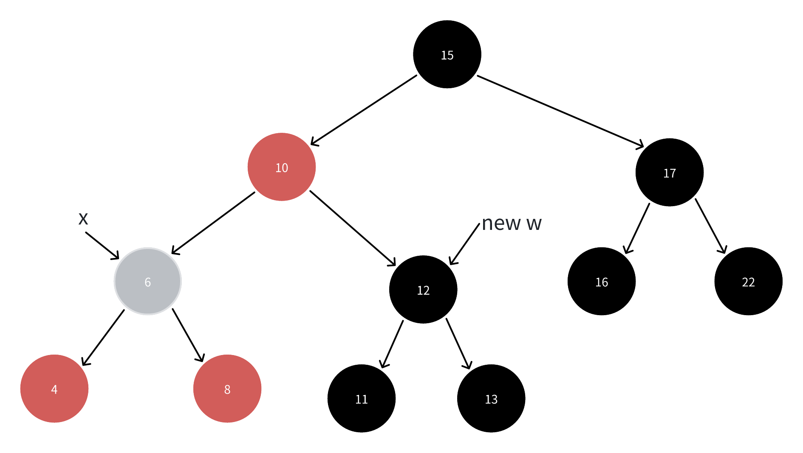
- 此时我们可以发现，既然 w 有一重黑色，x 也有多出来的一重黑色
- 那么我们实际上可以把二者的黑色 "取出" 一重给上面的结点 10（无论它是红还是黑）
    - 如果像图中这样，结点 10 是红色的，那么很明显，我们把 x 和 w 中的一重黑色传递给结点 10 后
    - 它作为新的 x 结点，就不再是双重黑色的了
    - 换句话说，我们就可以退出循环，把它染成纯黑而结束调整了！
    - 而就算结点 10 原本是黑色的，我们也把 x 结点往上挪动了一层
    - 这样最后我们把 x 挪到根结点，就算是双重黑结点，也能去掉多余的那一重黑色
### 如果能一直持续情况 2 这个循环，那么我们可以预见，最后会把结点 x 上移到根结点

### 情况 2 对应的是： x 的兄弟结点 w 是黑色的，而且 w 的两个子结点都是黑色的
### 我们下面来看下另外的情况：

## 情况4: x 的兄弟结点 w 是黑色的，而且 w 的右孩子是红色的
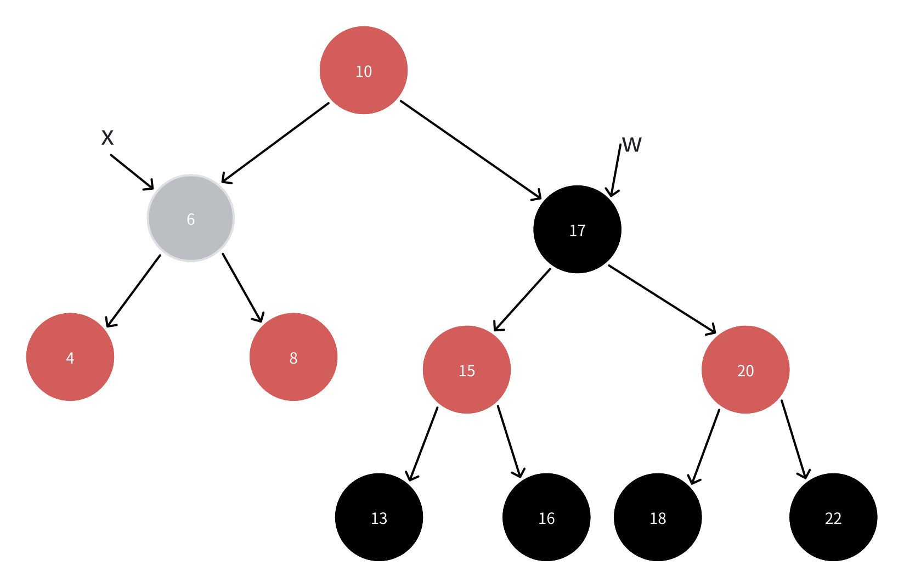
- 在这种情况下，基于旋转的概念，我们可以完成一件很神奇的事情
    - 首先，对结点 10 进行左旋，我们可以把 w 的左孩子挪到结点 10 的右孩子处
    - 原本到结点 15 需要经过一个黑色结点，那么我们只需要把左旋过来的结点 10 也染成黑色，就可以顶掉被旋转下去的结点 x 多出来的那一重黑色
    - 这样，左半边树的性质就被满足了
    - 之后，我们把旋转上去的 w 结点改成结点 10 原本的颜色，这样就可以完美的去掉结点 x 的双重黑色，完成全部的性质维护：

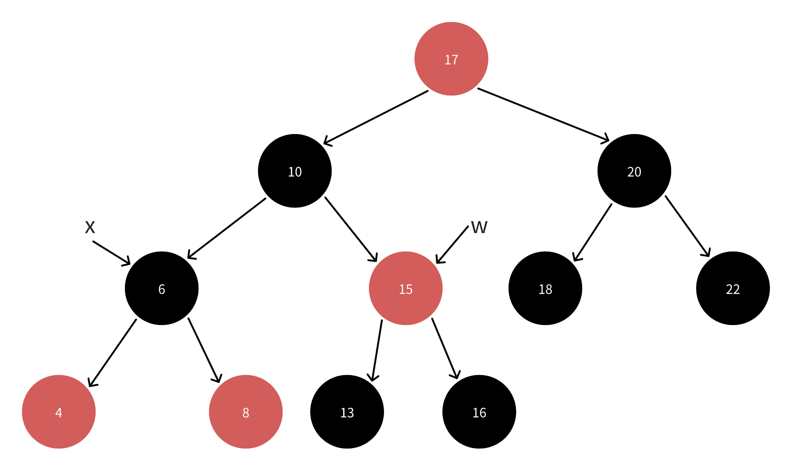
- 检查一下，不难发现，我们已经完美的解决了性质 1 的问题
- 此时结点 6 不再有多出来的一重黑色
- 但是，这里和上面的循环的退出条件并不相符
    - 此时 x 仍然指向结点 6，而它（如你所见）几乎从不是根结点，同时也被染成了黑色
    - 所以，我们需要人为把 x 指向根结点，这样才能退出循环
### 上面提到的两种情况，都是在 x 的兄弟结点是黑色的前提下
### 这种前提下还剩一种情况没有考虑
## 情况3: x 的兄弟结点 w 是黑色的，而且 w 的左孩子是红色的，w 的右孩子是黑色的
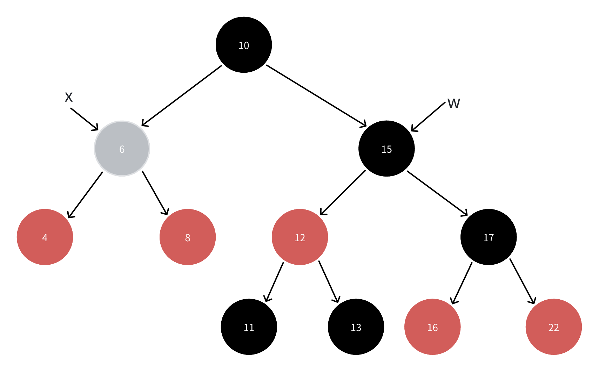
- 经过上面的讨论，我们知道情况 4 是最简单的情况
- 那么我们在这里同样可以尝试把这种情况通过旋转和染色的操作转换成情况 4：

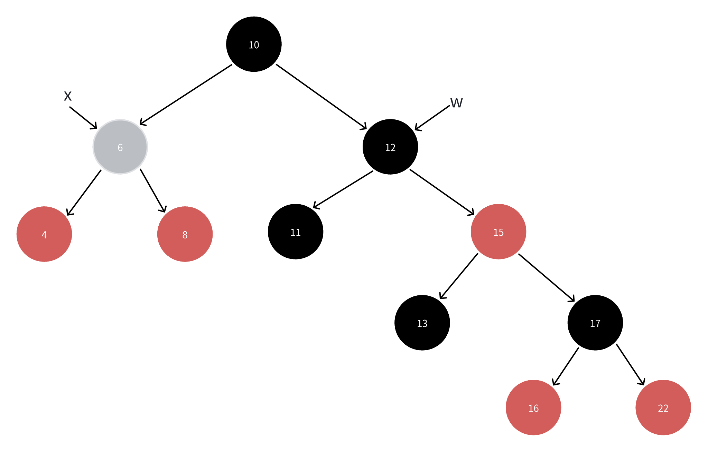

- 注意到，我们只需要把 w 的左孩子染成黑色，并让它旋转上来代替 w 结点，同时把 w 结点染成红色，然后让它旋转到自己右孩子处即可：
- 可以对比看一下上下两张图，单纯的旋转并不会导致二叉搜索树性质的破坏
- 同时，我们也通过重新染色，保证了这个过程中没有其它的红黑性质被破坏
- 最后拿到的这张图就满足了情况 4 的条件

### 讨论完了 w 为黑色的情况，我们还剩下最后一种情况：w 为红色：
## 情况1：x 的兄弟结点 w 是红色的

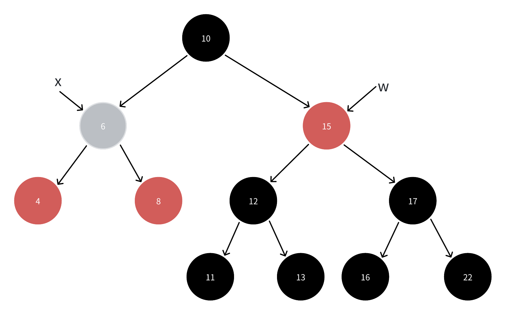

- 这种情况下，我们可以进行归一化处理，把它转换成 w 为黑色的情况：
- 注意到，w 是红色的，并且它是原本就存在于红黑树中的结点，红黑性质也没有被破坏
- 所以它的两个子结点一定是黑色的
- 我们可以通过对 x.p（这里的结点 10）进行左旋，把 w 的左孩子变成 x 的新兄弟结点
- 这样 x 的兄弟结点就变成了黑色
- 注意，旋转过程中需要使用一些染色操作，来维护红黑性质的完好性：

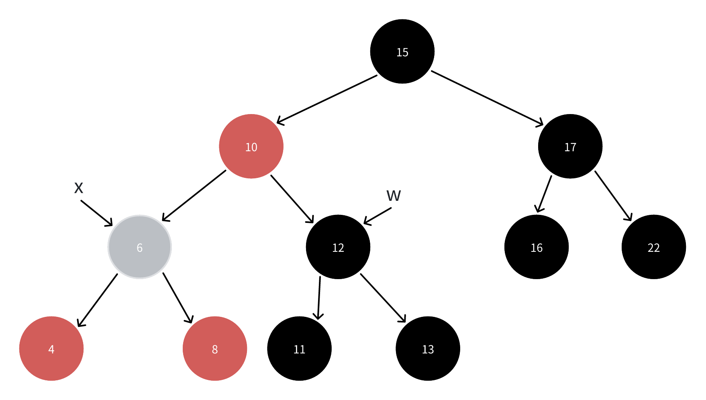
- 注意到，此时新的 w 结点就是黑色的了，我们就可以正常进入情况 2、3 或 4

### 总结下来，不难发现
- 无论是插入操作还是删除操作，红黑树的整体维护时间复杂度不会大于 O(logn) （n 为红黑树的结点数）

### 终于理清了逻辑，我们来看 Linux 内核源码是怎么实现 erase 相关函数的