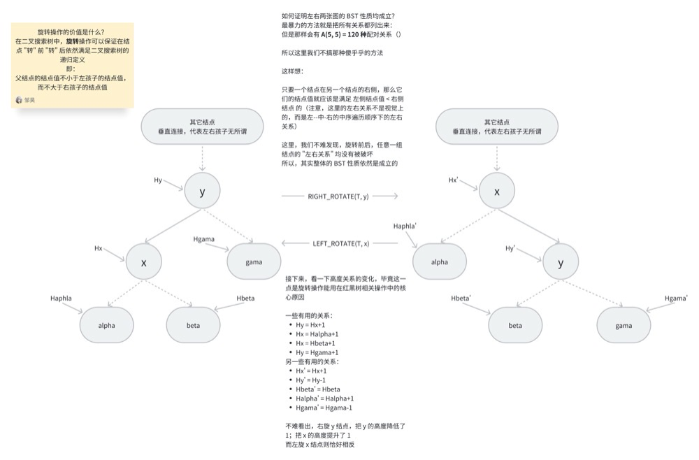

## Linux Epoll I/O 多路复用机制详解
前置知识要求：
- [红黑树算法实现](#clip1)
- [红黑树基本原理](#clip2)

<span id="clip1"></span>

### 红黑树算法实现

首先，引用一下 Linux 官方实现文档中关于 [What is red-black trees](https://github.com/torvalds/linux/blob/master/Documentation/core-api/rbtree.rst) 的描述：
- Red-black trees are a type of self-balancing binary binary search tree. (红黑树是一种自平衡的二叉搜索树)
- Used for storing sortable key/value data pairs. (用于存储可排序的键值对)

- Red-black trees are similar to AVL trees, (红黑树与 AVL 树类似，AVL 即平衡二叉树) 
- but provide faster real-time bounded worst case performance for insertion and deletion <u>(at most two rotations and three rotations, respectively</u>, to balance the tree), with slightly slower <u>(but still O(logn))</u> lookup time.

#### 不用看太多的前置 include 和宏定义，我们看一下 rb_tree.h 文件的一些基本的结构体定义和函数重命名

``` C
struct rb_node
{
    unsigned long __rb_parent_color;  // 当前红黑结点的父结点的颜色
    struct rb_node* rb_right;         // 当前红黑结点的右子结点
    struct rb_node* rb_left;          // 当前红黑结点的左子结点
} __attribute__((aligned(sizeof(long))));
// 这里的 align 编译器指令宏用于指定结构体的对齐方式，这里指定为 long 的大小，即 8 字节

// 额外封装了一个代表根结点的结构体
struct rb_root
{
    struct rb_node* rb_node;
};

// 这里的 & ~3 应该和颜色的具体数值定义有关
// 我们只需要知道这个宏是用于获取当前红黑树结点的父结点的地址即可
#define rb_parent(r) ((struct rb_node*)((r)->__rb_parent_color & ~3))

// 第二个大括号是一个初始化列表，用于把 rb_root 的 rb_node 成员初始化为 NULL
// 这个逗号不用管，编译器是允许的，而且它并没有实际的作用
#define RB_ROOT {struct rb_root} { NULL, }

// container 宏用于获取这个 ptr 指针代表的结构体成员所在的结构体的地址
// type 和 member 用于计算 ptr 指针在结构体类型中的偏移量，也就是 offsetof(type, member)，这里的 type 是结构体的类型，member 是结构体成员的名称
// (char*)(ptr)-offsetof(type, member) 就是 ptr 指针代表的结构体成员所在的结构体的地址
#define rb_entry(ptr, type, member) container_of(ptr, type, member)

// 用于判断一个红黑树结点是否为空结点
// 这里似乎就是 hard-code 的判空逻辑，如果 __rb_parent_color 的值等于了当前结点的地址，那么这个结点就是空结点
#define RB_EMPTY_NODE(node) \
        ((node)->__rb_parent_color == (unsigned long)(node))
// 用于清空一个红黑树结点
#define RB_CLEAR_NODE(node) \
        ((node)->__rb_parent_color = (unsigned long)(node))

// 注意，这个函数是用于调整红黑树的平衡性的，并不是进行结点添加的
extern void rb_insert_color(struct rb_node*, struct rb_root*);
extern void rb_erase(struct rb_node*, struct rb_root*);

// 逻辑上的前序和后序结点
/* Find logical next and and previous nodes in a tree */
extern struct rb_node* rb_next(const struct rb_node*);
extern struct rb_node* rb_prev(const struct rb_node*);
extern struct rb_node* rb_first(const struct rb_root*);
extern struct rb_node* rb_last(const struct rb_root*);

// 后序遍历函数，先访问子结点，再访问父结点
/* Postorder iteration - always visit the parent after its children */
extern struct rb_node* rb_first_postorder(const struct rb_root*);
extern struct rb_node* rb_next_postorder(const struct rb_node*);

// 替换红黑树中的结点，不做任何的删除和重新平衡的操作
/* Fast replacement of a single node without remove/rebalance/add/rebalance */
extern void rb_replace_node(struct rb_node* victim, struct rb_node* new, struct rb_node* root);

// 这里的写法可能有些奇怪，但是 rb_link 从后文用法来看，它就是 parent 的某个子结点的指针的指针，这里用这样的方式来对其进行赋值
// 总结来说，这个函数用于把 node 插入到 parent 的某个子结点的位置上
static inline void rb_link_node(struct rb_node* node, struct rb_node* parent, struct rb_node** rb_link)
{
    node->__rb_parent_color = (unsigned long)parent;
    node->rb_left = node->rb_right = NULL;

    *rb_link = node;
}

// 封装了一下 rb_entry 宏，用于安全地获取一个成员指针所在的结构体的地址
#define rb_entry_safe(ptr, type, member) \
        ({ typeof(ptr) ____ptr = (ptr); \
           ____ptr ? rb_entry(____ptr, type, member) : NULL; \
        })
```

-- -
#### 接下来是一些基本红黑树操作的内联实现
``` C
/**
 * rbtree_postorder_for_each_entry_safe - iterate in post-order over rb_root of
 * given type allowing the backing memory of @pos to be invalidated
 * 
 * @pos:   the 'type *' to use as a loop cursor.
 * @n:     another 'type *' to use as temporary storage
 * @root:  'rb_root *' of the rbtree.
 * @field: the name of the rb_node field within 'type'.
 * 
 * rb_tree_postorder_for_each_entry_safe() provides a similar guarantee as 
 * list_for_each_entry_safe() and allows the iteration to continue independent 
 * of changes to @pos by the body of the loop.
 * 
 * Note, however, that is cannot handle other modifications that re-order the 
 * rbtree it is iterating over. This includes calling rb_erase() on @pos, as rb_erase() may rebalance the tree, causing us to miss some nodes.
 * */
#define rb_tree_postorder_for_each_entry_safe(pos, n, root, field) \
   for(pos = rb_entry_safe(rb_first_postorder(root), typeof(*pos), field); \
       pos && ({n = rb_entry_safe(rb_next_postorder(&pos->field), \
       typeof(*pos), field); 1; }); \
       pos = n)
/* 
    展开看一下：
    for(pos = rb_entry_safe(rb_first_postorder(root), typeof(*pos), field); )
    这里是 for 循环三段内容中的第一段，用于初始化 pos 变量，让它指向 root 红黑树的第一个结点
    pos && ({n = rb_entry_safe(rb_next_postorder(&pos->field), typeof(*pos), field); 1; }); )
    这里是 for 循环三段内容中的第二段，用于获取 pos 指针指向的结构中的下一个结点指针
    同时，它也是一个语句表达式扩展， {n = rb_entry_safe(rb_next_postorder(&pos->field), typeof(*pos), field); 1; } 这个语句块的返回值就是后面的这最后一个表达式，也就是 1;
    pos = n;
    这里是 for 循环三段内容中的第三段，用于更新 pos 变量，让它指向后序遍历中的下一个结点
*/

// 根据名字推断，这个函数用于把 n 从 root 红黑树中删除，并且把 n 本身清空
static inline void rb_erase_init(struct rb_node* n, struct rb_root* root)
{
    rb_erase(n, root);
    RB_CLEAR_NODE(n);
}
```

``` C
/**
 * leftmost-cached rbtrees
 * 这个最左缓存红黑树，目前还不清楚是什么意思，往下看（）
 * 
 * We do not cache the rightmost node based on footprint
 * size vs number of potential users that could benefit
 * from O(1) to rb_last(). Just not worth it, users that want
 * this feature can always implement the logic explicitly.
 * Furthermore, users that want to cache both pointers may 
 * find it a bit asymmetric, but that's ok.
 * */
// 缓存结构体，保存的是一棵红黑树，以及该红黑树的最左侧结点
struct rb_root_cached
{
    struct rb_root rb_root;
    struct rb_node* rb_leftmost;
};

// 初始化一个空的缓存结构体
#define RB_ROOT_CACHED {struct rb_root_cached} { {NULL, }, NULL }

/* Same as rb_first(), but O(1) */
#define rb_first_cached(root) root->rb_leftmost

// 封装了 rb_insert_color 函数
static inline void rb_insert_color_cached(struct rb_node* node, struct rb_root_cached* root, bool leftmost)
{
    // 如果规定这个结点要插入成最左结点，那么就把 root 的 rb_leftmost 成员设置成 node
    if(leftmost)
        root->rb_leftmost = node;
    // 将 root 中的 node 结点进行平衡调整，维护树的红黑性质
    rb_insert_color(node, &root->rb_root);
}

// 封装了 rb_erase 函数
static inline void rb_erase_cached(struct rb_node* node, struct rb_root_cached* root)
{
    // 如果 node 是 root 红黑树的最左侧结点，那么就把 root 的 rb_leftmost 成员设置成 node 的下一个结点
    if(root->rb_leftmost == node)
        root->rb_leftmost = rb_next(node);
    // 将 node 从 root 红黑树中删除
    rb_erase(node, &root->rb_root);
}

// 封装了 rb_replace_node 函数
static inline void rb_replace_node_cached(struct rb_node* victim, struct rb_node* new, struct rb_root_cached* root)
{
    // 如果 victim 是 root 红黑树的最左侧结点，那么就把 root 的 rb_leftmost 成员设置成 new
    if(root->rb_leftmost == victim)
        root->rb_leftmost = new;
    // 用 new 结点替换 victim 结点
    rb_replace_node(victim, new, &root->rb_root);
}
```

``` C
/**
 * The below helper functions use 2 operators with 3 different
 * calling conventions. The operators are related like:
 * 
 * comp(a->key, b) < 0  := less(a, b)
 * comp(a->key, b) > 0  := less(b, a)
 * comp(a->key, b) == 0 := !less(a,b) && !less(b,a)
 * 
 * 下面提到的 partial order，也就是偏序，代表，集合中并不是所有元素都是可以进行比较的
 * If these operators define a partial order on the elements we make no
 * guarantee on which of the elements matching the key is found. See
 * rb_find().
 * 
 * The reason for this is to allow the find() interface without requiring an 
 * on-stack dummy object, which might not be feasible due to object size.
 * */
```

``` C
/**
 * rb_add_cached() - insert @node into the leftmost cached tree @tree
 * @node: node to insert
 * @tree: leftmost cached tree to insert @node into
 * @less: operator defining the (partial) node order
 * */
static __always_inline void rb_add_cached(struct rb_node* node, struct rb_root_cached* tree, bool (*less)(struct rb_node*, const struct rb_node*))
{
    // link 二级指针指向 tree 的根结点
    struct rb_node** link = &tree->rb_root.rb_node;
    struct rb_node* parent = NULL;
    bool leftmost = true;

    // link 用于遍历红黑树，找到合适的位置插入 node 结点
    while(*link)
    {
        parent = *link;
        // 如果 node 的 key 小于 parent 的 key，那么可能的插入位置就在 parent 的左子树中
        // 否则，可能的插入位置就在 parent 的右子树中
        if(less(node, parent))
        {
            link = &parent->rb_left;
        } 
        else
        {
            link = &parent->rb_right;
            leftmost = false;
        }
    }

    // 结点插入，不做平衡调整
    rb_link_node(node, parent, link);
    // 进行平衡调整，包含缓存操作
    rb_insert_color_cached(node, tree, leftmost);
}

/**
 * rb_add() - insert @node into @tree
 * @node: node to insert
 * @tree: tree to insert @node into
 * @less: operator defining the (partial) node order
 * */
static __always_inline void rb_add(struct* node, struct rb_root* tree, bool (*less)(struct rb_node*, const struct rb_node*))
{
    struct rb_node** link = &tree->rb_node;
    struct rb_node* parent = NULL;

    while(*link)
    {
        parent = *link;
        if(less(node, parent))
            link = &parent->rb_left;
        else
            link = &parent->rb_right;
    }

    rb_link_node(node, parent, link);
    rb_insert_color(node, tree);
}
```

``` C
/**
 * rb_find_add() - find equivalent @node in @tree, or add @node
 * @node: node to look-for / insert
 * @tree: tree to search / modify
 * @cmp: operator defining the node order
 * 
 * Returns the rb_node matching @node, or NULL when no match is found and @node
 * is inserted.
 * */

// 复合功能函数，用于从 tree 中检查是否有和 node 等价的结点
// 如果有等价的结点，那么就直接返回这个等价结点的指针，否则，进行新结点添加，并返回 NULL
static __always_inline struct rb_node* rb_find_add(struct rb_node* node, struct rb_root* tree, int (*cmp)(struct rb_node*, const struct rb_node*))
{
    struct rb_node **link = &tree->rb_node;
    struct rb_node* parent = NULL;
    int c;

    while(*link)
    {
        parent = *link;
        c = cmp(node, parent);
        
        if(c < 0)
            link = &parent->rb_left;
        else if(c > 0)
            link = &parent->rb_right;
        else
            return parent;
    }

    rb_link_node(node, parent, link);
    rb_insert_color(node, tree);
    return NULL;
}

/**
 * rb_find_first() - find the first @key in @tree
 * @key: key to match
 * @tree: tree to search
 * @cmp: operator defining node order
 * 
 * Returns the leftmost node matching @key, or NULL.
 * */
static __always_inline struct rb_node* rb_find_first(const void* key, const struct rb_root* tree, int (*cmp)(const void* key, const struct rb_node*))
{
    struct rb_node* node = tree->rb_node;
    struct rb_node* match = NULL;

    while(node)
    {
        int c = cmp(key, node);

        if(c <= 0)
        {
            // 如果找到了，那么就更新 match 返回值，并继续往左探查，这一点跟注释说明的，找出最左侧的等价结点是统一的
            if(!c)
                match = node;
            node = node->rb_left;
        } else if(c > 0)
        {
            node = node->rb_right;
        }
    }

    return match;
}

/** 
 * rb_next_match() - find the next @key in @tree
 * @key: key to match
 * @tree: tree to search
 * @cmp: operator defining node order
 * 
 * Returns the next node matching @key, or NULL.
 * */
static __always_inline struct rb_node* rb_next_match(const void* key, struct rb_node* node, int (*cmp)(const void* key, const struct rb_node*))
{
    // 先调用 rb_next 函数，找出 node 的中序下一个结点
    node = rb_next(node);
    // 如果这个下一个结点的值并不等于 node 的值，那么清空返回值
    // cmp 返回值非 0，代表两个值不相等
    if(node && cmp(key, node))
        node = NULL;
    // 返回结果
    return node;
}

// 这个函数的意义是什么呢？
/**
 * rb_for_each() - iterates a subtree matching @key
 * @node: iterator
 * @key: key to match
 * @tree: tree to search
 * @cmp: operator defining node order
 * */
#define rb_for_each(node, key, tree, cmp) \
        for ((node) = rb_find_first((key), (tree), (cmp)); \
             (node); (node) = rb_next_match((key), (node), (cmp)))
/*
    简单阅读一下这部分：
    for ((node) = rb_find_first((key), (tree), (cmp)); )
        for 循环的初始化 (第一段)，把 node 初始化成 tree 树中的第一个结点
    (node);
        for 循环的判断条件 (第二段)，这里只要 node 非空，就继续遍历
    (node) = rb_next_match((key), (node), (cmp))
        for 循环的更新步 (第三段)，用于从 node 代表的子树中找出下一个键值等于 key 的结点
*/
```

-- -
### 好，到这里先停一下，看完了头文件，我们来总结一下：
- 个人认为，Linux 官方源码对红黑树的实现并没有跳脱出《算法导论》第 13 章讲解的原理
- 有一个细节：
    - 官方代码在处理红黑树的插入和删除时，把删除步骤单独封装成了一个 rb_erase() 函数，并声明成了 extern，而插入步骤则分了详细的 rb_insert_color() 平衡步和 rb_link_node() 添加步
    - 个人猜测是编写者认为删除代码实在是不好理解，于是直接写了一个大函数（）
    - 不过估计但凡是完整阅读过算法导论第13章的同学，就知道删除操作的确很复杂（）
- <u>Linux 引入的一个比较新颖的优化点在于</u>：
    - leftmost-cached 机制
    - 简单来说就是，缓存一棵红黑树中最靠左的那个结点，在一些查询或更新操作中（实验经验）可能会有效率提升效果
- 之后是一个疑惑点
    - 个人比较疑惑的是，最后提到的这个函数：rb_for_each()
        - 并不清楚这个函数的作用是什么
        - 按理来说，如果是一个正常的合法红黑树（注意，同时也一定是一棵二叉搜索树）
        - 那么所有值相等的结点应该都是连在一起的
        - 那么这种 ”取出整个相等值子树” 的概念是否有必要单独写一个 helper function 出来？
        - 如果有必要，那么个人认为只能是基于不合法红黑树的平衡过程中使用了

#### 其它部分都比较常规，没看懂的，多看几次就能捋顺了
-- -
### 现在，在看 rb_tree.c 实现代码之前
### 我们回顾一下 （理论上） 红黑树的实现原理

<span id="clip2"></span>
-- -

##### 声明：下面的讲解，原文来自《算法导论》第三版第十三章，这里只是根据个人理解进行了一次再讲解

#### 第一，红黑树的理论基础是下面五条性质：

1. 红黑树中的结点要么是红色的，要么是黑色的
2. 红黑树的根结点是黑色的
3. 叶子结点都是黑色的
4. 红黑树中，红色结点的孩子结点一定是黑色的
5. 对于每个结点，从该结点到所有后代<u>叶结点</u>的简单路径上，都包含相同数量的黑色结点

#### 先不用管上面这五条性质是怎么来的，往下看，你就理解了，最重要的性质是性质 5 和性质 4

##### 提问：红黑树为什么是一种效率很高的树？
- ##### 结论：一棵有 n 个<u>内部结点</u>的红黑树的高度至多为 2lg(n+1)
证明过程并不难，我们定义这样一个名词：<u>黑高 (black height)</u>
- 从某个节点 x 出发<u>（不含该结点）</u>到达一个叶结点的任意一条简单路径上的<u>黑色结点</u>的个数。记为 bh(x)。
    - 这一性质基本上可以被认为是上面性质 5 的 "因"，根据这一定义，结合上面的性质 5，可以认为每一个结点的黑高都是<u>固定的</u>
``` txt
首先，以任一结点 x 为根的子树中至少包含 2^bh(x)-1 个内部结点
用归纳法可以证明：
    归纳基础步：如果 x 的 高度 为 0，那么 x 一定是叶子结点 (T.nil)

        且以 x 为根结点的子树至少包含 2^bh(x)-1 = 2^0-1 = 0 个内部结点，结论成立

    归纳步：考虑一个高度为正值且有两个子结点的内部结点 x。每个子结点有黑高 bh(x) 或 bh(x)-1 （取决于子结点本身是红结点还是黑结点）

    因为子结点的高度是低于 x 的，那么根据归纳假设，我们知道 每个 子结点至少有 2^(bh(x)-1)-1 个内部结点。（至多有 2^(bh(x)-1) 个内部结点

    那么我们就知道，以 x 为根的子树应该至少包含 

    (2^(bh(x)-1)-1)*2(两个子树) + 1(x 结点自身，它一定不是叶结点) = 2^bh(x)-1 

    个内部结点
    归纳法得证

其次，考虑之前的结论，h <= 2lg(n+1) (n 为内部结点个数)

    这里用到性质 4，从根结点到任意一个叶结点的简单路径上都至少有一半的结点为黑色。

    故，根的黑高至少为 h/2

    所以对于根结点有：

    n >= 2^(h/2)-1 (其中 n 为根结点代表的树，也就是整棵树的内部结点个数)

    转换一下，得到：

    lg(n+1) >= h/2 (其中 lg 以 2 为底)

    即

    h <= 2lg(n+1)
```

- 至此，我们已经了解了红黑树为什么效率较高，也明白了看起来不那么直接的性质 4 和性质 5 到底是怎么来的

### 接下来，回顾一下我们上面看过的 .h 头文件
#### 如果你比较细心，应该已经发现了，.h 头文件中编写者很工整地排列了所有需要在 .c 文件中实现的外部函数 (extern 修饰的所有函数)

- 我们先不急着看它们的具体实现，思考永远比读代码来得简单

- 首先来看一个 "如果学过二叉搜索树，一定应该会" 的知识点
    - 旋转操作
        - 我们结合一张图来研究一下
        
